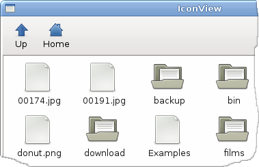
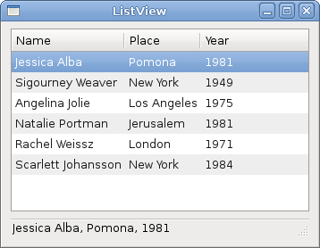
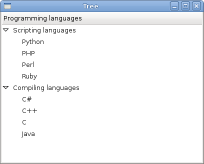

# Advanced widgets in GTK#

In this part of the GTK# programming tutorial, we will introduce some more advanced widgets in the GTK#. We will cover IconView, ListView and TreeView widgets.


## IconView

The `IconView` is a widget which displays a list of icons in a grid.

iconview.cs

```csharp
using System;
using System.IO;
using Gtk;


public class SharpApp : Window
{
    const int COL_PATH = 0;
    const int COL_DISPLAY_NAME = 1;
    const int COL_PIXBUF = 2;
    const int COL_IS_DIRECTORY = 3;

    DirectoryInfo root = new DirectoryInfo("/");
    Gdk.Pixbuf dirIcon, fileIcon;
    ListStore store;
    ToolButton upButton;

    public SharpApp() : base("IconView")
    {
        SetDefaultSize(650, 400);
        SetPosition(WindowPosition.Center);
        DeleteEvent += delegate { Application.Quit(); };

        VBox vbox = new VBox(false, 0);
        Add(vbox);

        Toolbar toolbar = new Toolbar();
        vbox.PackStart(toolbar, false, false, 0);

        upButton = new ToolButton(Stock.GoUp);
        upButton.IsImportant = true;
        upButton.Sensitive = false;
        toolbar.Insert(upButton, -1);

        ToolButton homeButton = new ToolButton(Stock.Home);
        homeButton.IsImportant = true;
        toolbar.Insert(homeButton, -1);

        fileIcon = GetIcon(Stock.File);
        dirIcon = GetIcon(Stock.Open);

        ScrolledWindow sw = new ScrolledWindow();
        sw.ShadowType = ShadowType.EtchedIn;
        sw.SetPolicy(PolicyType.Automatic, PolicyType.Automatic);
        vbox.PackStart(sw, true, true, 0);

        store = CreateStore();
        FillStore();

        IconView iconView = new IconView(store);
        iconView.SelectionMode = SelectionMode.Multiple;

        upButton.Clicked += new EventHandler(OnUpClicked);
        homeButton.Clicked += new EventHandler(OnHomeClicked);

        iconView.TextColumn = COL_DISPLAY_NAME;
        iconView.PixbufColumn = COL_PIXBUF;

        iconView.ItemActivated += OnItemActivated;
        sw.Add(iconView);
        iconView.GrabFocus();
        
        ShowAll();
    }

    Gdk.Pixbuf GetIcon(string name)
    {
        return Gtk.IconTheme.Default.LoadIcon(name, 48, (IconLookupFlags) 0);
    }

    ListStore CreateStore()
    {
        ListStore store = new ListStore(typeof (string), 
            typeof(string), typeo (Gdk.Pixbuf), typeof(bool));

        store.SetSortColumnId(COL_DISPLAY_NAME, SortType.Ascending);

        return store;
    }

    void FillStore()
    {
        store.Clear();

        if (!root.Exists)
            return;

        foreach (DirectoryInfo di in root.GetDirectories())
        {
            if (!di.Name.StartsWith("."))
                store.AppendValues(di.FullName, di.Name, dirIcon, true);
        }
        
        foreach (FileInfo file in root.GetFiles())
        {
            if (!file.Name.StartsWith("."))
                store.AppendValues(file.FullName, file.Name, fileIcon, false);
        }
    }

    void OnHomeClicked(object sender, EventArgs a)
    {
        root = new DirectoryInfo(Environment.GetFolderPath(
            Environment.SpecialFolder.Personal));
        FillStore();
        upButton.Sensitive = true;
    }

    void OnItemActivated(object sender, ItemActivatedArgs a)
    {
        TreeIter iter;
        store.GetIter(out iter, a.Path);
        string path = (string) store.GetValue(iter, COL_PATH);
        bool isDir = (bool) store.GetValue(iter, COL_IS_DIRECTORY);

        if (!isDir)
            return;

        root = new DirectoryInfo(path);
        FillStore();

        upButton.Sensitive = true;
    }

    void OnUpClicked(object sender, EventArgs a)
    {
        root = root.Parent;
        FillStore();
        upButton.Sensitive = (root.FullName == "/" ? false : true);
    }
    
    public static void Main()
    {   
        Application.Init();
        new SharpApp();
        Application.Run();
    }
}
```

This example shows icons of the currently selected directory. It has a toolbar and two buttons. Up button and home button. We use them to navigate through the file system.

```csharp
ListStore store;
```

The `ListStore` is a columned list data structure. We use it to store our data for the `IconView` widget.

```csharp
DirectoryInfo root = new DirectoryInfo("/");
```

This is the root directory. We start here. The root directory is the directory, which we show in the `IconView` widget.

```csharp
ListStore store = new ListStore(typeof(string), 
    typeof(string), typeof(Gdk.Pixbuf), typeof(bool));
```


In the `CreateStore()` method, we create the `ListStore` object. It has four parameters. The path, the name of the directory or file, image and the boolean value determining if it is an directory or a file.

```csharp
foreach (DirectoryInfo di in root.GetDirectories())
{
    if (!di.Name.StartsWith("."))
        store.AppendValues(di.FullName, di.Name, dirIcon, true);
}
```

In the `FillStore()` method, we fill the list store with data. Here, we find out all directories in the current path.

```csharp
void OnHomeClicked(object sender, EventArgs a)
{
    root = new DirectoryInfo(Environment.GetFolderPath(Environment.SpecialFolder.Personal));
    FillStore();
    upButton.Sensitive = true;
}
```

If we click on the home button, we get the reference to the home directory. Refill the list store. And make the up button active.

```csharp
void OnItemActivated(object sender, ItemActivatedArgs a)
{ 
...
}
```

In the `OnItemActivated()` method, we react to an event, which is generated, when we click on a icon from the icon view widget.


```csharp
string path = (string) store.GetValue(iter, COL_PATH);
bool isDir = (bool) store.GetValue(iter, COL_IS_DIRECTORY);

if (!isDir)
    return;
```

We get the path of the activated item. And we determine if it is a directory or a file. If it is a file, we return.

```csharp
root = new DirectoryInfo(path);
FillStore();

upButton.Sensitive = true;
```

In case it is a directory, we replace the root with the current path, refill the store and make the up button sensitive.

```csharp
void OnUpClicked(object sender, EventArgs a)
{
    root = root.Parent;
    FillStore();
    upButton.Sensitive = (root.FullName == "/" ? false : true);
}
```

If we click on the up button, we replace the root directory with its parent directory. Refill the list store. And the up button is activated if we are below the root (/) directory of the file system.

Figure: IconView


## ListView

In the following example, we use the `TreeView` widget to show a list view. Again the `ListStore` is used to store data.

listview.cs

```csharp
using System;
using System.Collections;
using Gtk;

public class Actress
{
    public string Name;
    public string Place;
    public int Year;

    public Actress(string name, string place, int year)
    {
        Name = name;
        Place = place;
        Year = year;
    }
}

public class SharpApp : Window
{
    ListStore store;
    Statusbar statusbar;
    
    enum Column
    {
        Name,
        Place,
        Year
    }

    Actress[] actresses =
    {
        new Actress("Jessica Alba", "Pomona", 1981),
        new Actress("Sigourney Weaver", "New York", 1949),
        new Actress("Angelina Jolie", "Los Angeles", 1975),
        new Actress("Natalie Portman", "Jerusalem", 1981),
        new Actress("Rachel Weissz", "London", 1971),
        new Actress("Scarlett Johansson", "New York", 1984) 
    };

    public SharpApp() : base ("ListView")
    {
        BorderWidth = 8;

        SetDefaultSize(350, 250);
        SetPosition(WindowPosition.Center);
        DeleteEvent += delegate { Application.Quit(); };

        VBox vbox = new VBox(false, 8);
        

        ScrolledWindow sw = new ScrolledWindow();
        sw.ShadowType = ShadowType.EtchedIn;
        sw.SetPolicy(PolicyType.Automatic, PolicyType.Automatic);
        vbox.PackStart(sw, true, true, 0);

        store = CreateModel();

        TreeView treeView = new TreeView(store);
        treeView.RulesHint = true;
        treeView.RowActivated += OnRowActivated;
        sw.Add(treeView);

        AddColumns(treeView);
        
        statusbar = new Statusbar();
        
        vbox.PackStart(statusbar, false, false, 0);

        Add(vbox);
        ShowAll();
    }

    void OnRowActivated (object sender, RowActivatedArgs args) {

        TreeIter iter;        
        TreeView view = (TreeView) sender;   
        
        if (view.Model.GetIter(out iter, args.Path)) {
            string row = (string) view.Model.GetValue(iter, (int) Column.Name );
            row += ", " + (string) view.Model.GetValue(iter, (int) Column.Place );
            row += ", " + view.Model.GetValue(iter, (int) Column.Year );
            statusbar.Push(0, row);
        }
    }

    void AddColumns(TreeView treeView)
    {
        CellRendererText rendererText = new CellRendererText();
        TreeViewColumn column = new TreeViewColumn("Name", rendererText,
            "text", Column.Name);
        column.SortColumnId = (int) Column.Name;
        treeView.AppendColumn(column);

        rendererText = new CellRendererText();
        column = new TreeViewColumn("Place", rendererText, 
            "text", Column.Place);
        column.SortColumnId = (int) Column.Place;
        treeView.AppendColumn(column);

        rendererText = new CellRendererText();
        column = new TreeViewColumn("Year", rendererText, 
            "text", Column.Year);
        column.SortColumnId = (int) Column.Year;
        treeView.AppendColumn(column);
    }


    ListStore CreateModel()
    {
        ListStore store = new ListStore( typeof(string),
            typeof(string), typeof(int) );

        foreach (Actress act in actresses) {
            store.AppendValues(act.Name, act.Place, act.Year );
        }

        return store;
    }
    
    public static void Main()
    {
        Application.Init();
        new SharpApp();
        Application.Run();
    }
} 
```

In our example, we show a list of six actresses in the `TreeView` widget. Each of the rows shows the name, the place of born and the year of born for each of them.


```csharp
public class Actress
{
    public string Name;
    public string Place;
    public int Year;
...
}
```

The `Actress` class is used for storing data about an actress.

```csharp
ListStore CreateModel()
{
    ListStore store = new ListStore( typeof(string), 
        typeof(string), typeof(int) );

    foreach (Actress act in actresses) {
        store.AppendValues(act.Name, act.Place, act.Year );
    }

    return store;
}
```

In the `CreateModel()` method, we create the list store. The list store has three parameters. The name of the actress, the place of born and year of born. This is the data model of our `TreeView` widget.

```csharp
TreeView treeView = new TreeView(store);
treeView.RulesHint = true;
treeView.RowActivated += OnRowActivated;
```

Here we create the `TreeView` widget, taking the list store as a parameter.

```csharp
CellRendererText rendererText = new CellRendererText();
TreeViewColumn column = new TreeViewColumn("Name", rendererText, "text", Column.Name);
column.SortColumnId = (int) Column.Name;
treeView.AppendColumn(column);
```

In the `AddColumns()` method, we add three columns to our `TreeView` widget. The above code creates a column displaying names of the actresses.

```csharp
if (view.Model.GetIter(out iter, args.Path)) {
    string row = (string) view.Model.GetValue(iter, (int) Column.Name );
    row += ", " + (string) view.Model.GetValue(iter, (int) Column.Place );
    row += ", " + view.Model.GetValue(iter, (int) Column.Year );
    statusbar.Push(0, row);
}
```


If we double click on an item, we display the whole row in the statusbar.

Figure: ListView


## TreeView

In the last example of this chapter, we use the `TreeView` widget to show a hierarchical tree of data.

tree.cs

```csharp
using Gtk;


public class SharpApp : Window
{
    
    public SharpApp() : base ("Tree")
    {
        SetDefaultSize(400, 300);
        SetPosition(WindowPosition.Center);
        DeleteEvent += delegate { Application.Quit(); };
 
        TreeView tree = new TreeView();
        
        TreeViewColumn languages = new TreeViewColumn();
        languages.Title = "Programming languages";
 
        CellRendererText cell = new CellRendererText();
        languages.PackStart(cell, true);
        languages.AddAttribute(cell, "text", 0);
 
        TreeStore treestore = new TreeStore(typeof(string), typeof(string));
 
        TreeIter iter = treestore.AppendValues("Scripting languages");
        treestore.AppendValues(iter, "Python");
        treestore.AppendValues(iter, "PHP");
        treestore.AppendValues(iter, "Perl");
        treestore.AppendValues(iter, "Ruby");
 
        iter = treestore.AppendValues("Compiling languages");
        treestore.AppendValues(iter, "C#");
        treestore.AppendValues(iter, "C++");
        treestore.AppendValues(iter, "C");
        treestore.AppendValues(iter, "Java");
 
        tree.AppendColumn(languages);
        tree.Model = treestore;
        
        Add(tree);
        ShowAll();
    }
    
    public static void Main()
    {
        Gtk.Application.Init();
        new SharpApp();
        Gtk.Application.Run();
    }
}
```

This time we use the `TreeView` widget to show hierarchical data.

```csharp
TreeView tree = new TreeView();
```

`TreeView` widget is created.

```csharp
TreeViewColumn languages = new TreeViewColumn();
languages.Title = "Programming languages";
```

It has one column named "Programming languages".

```csharp
CellRendererText cell = new CellRendererText();
languages.PackStart(cell, true);
languages.AddAttribute(cell, "text", 0);
```

We show textual data in the `TreeView` widget.

```csharp
TreeStore treestore = new TreeStore(typeof(string), typeof(string));
```

To store the data, we use the `TreeStore` object.

```csharp
TreeIter iter = treestore.AppendValues("Scripting languages");
treestore.AppendValues(iter, "Python");
treestore.AppendValues(iter, "PHP");
```

We append data to the tree. The `TreeIter` is for accessing data in a row.

```csharp
tree.AppendColumn(languages);
```

A column is appended to the tree.

```csharp
tree.Model = treestore;
```

Finally, we set a data model for the tree widget.

Figure: Tree


In this chapter, we were talking about advanced GTK# widgets.

[Previous](./widgetsII.md) [Next](./dialogs.md)