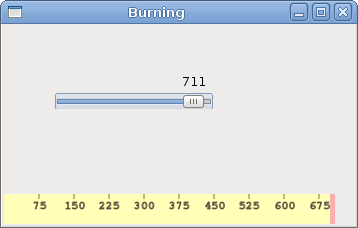

# Custom widget in GTK#

Toolkits usually provide only the most common widgets like buttons, text widgets, sliders etc. No toolkit can provide all possible widgets.


More specialised widgets are created by client programmers. They do it by using the drawing tools provided by the toolkit. There are two possibilities: a programmer can modify or enhance an existing widget, or he can create a custom widget from scratch.

## Burning widget

This is an example of a widget that we create from scratch. This widget can be found in various media burning applications, like Nero Burning ROM.

burning.cs

```csharp
using Gtk;
using Cairo;
using System;
 
class Burning : DrawingArea
{

    string[] num = new string[] { "75", "150", "225", "300", 
        "375", "450", "525", "600", "675" };

    public Burning() : base()
    {
        SetSizeRequest(-1, 30);
    }

    protected override bool OnExposeEvent(Gdk.EventExpose args)
    {
        
        Cairo.Context cr = Gdk.CairoHelper.Create(args.Window);
        cr.LineWidth = 0.8;

        cr.SelectFontFace("Courier 10 Pitch", 
            FontSlant.Normal, FontWeight.Normal);
        cr.SetFontSize(11);

        int width = Allocation.Width;

        SharpApp parent = (SharpApp) GetAncestor (Gtk.Window.GType);        
        int cur_width = parent.CurValue;

        int step = (int) Math.Round(width / 10.0);

        int till = (int) ((width / 750.0) * cur_width);
        int full = (int) ((width / 750.0) * 700);

        if (cur_width >= 700) {
            
            cr.SetSourceRGB(1.0, 1.0, 0.72);
            cr.Rectangle(0, 0, full, 30);
            cr.Clip();
            cr.Paint();
            cr.ResetClip();
            
            cr.SetSourceRGB(1.0, 0.68, 0.68);
            cr.Rectangle(full, 0, till-full, 30);    
            cr.Clip();
            cr.Paint();
            cr.ResetClip();

        } else { 
             
            cr.SetSourceRGB(1.0, 1.0, 0.72);
            cr.Rectangle(0, 0, till, 30);
            cr.Clip();
            cr.Paint();
            cr.ResetClip();
       }  

       cr.SetSourceRGB(0.35, 0.31, 0.24);
       
       for (int i=1; i<=num.Length; i++) {
           
           cr.MoveTo(i*step, 0);
           cr.LineTo(i*step, 5);    
           cr.Stroke();
           
           TextExtents extents = cr.TextExtents(num[i-1]);
           cr.MoveTo(i*step-extents.Width/2, 15);
           cr.TextPath(num[i-1]);
           cr.Stroke();
       }
        
        ((IDisposable) cr.Target).Dispose();                                      
        ((IDisposable) cr).Dispose();

        return true;
    }
}


class SharpApp : Window {
 
    int cur_value = 0;
    Burning burning;
    
    public SharpApp() : base("Burning")
    {
        SetDefaultSize(350, 200);
        SetPosition(WindowPosition.Center);
        DeleteEvent += delegate { Application.Quit(); };
       
        VBox vbox = new VBox(false, 2);
        
        HScale scale = new HScale(0, 750, 1);
        scale.SetSizeRequest(160, 35);
        scale.ValueChanged += OnChanged;
        
        Fixed fix = new Fixed();
        fix.Put(scale, 50, 50);
        
        vbox.PackStart(fix);
        
        burning = new Burning();
        vbox.PackStart(burning, false, false, 0);

        Add(vbox);

        ShowAll();
    }
    
    void OnChanged(object sender, EventArgs args)
    {
        Scale scale = (Scale) sender;
        cur_value = (int) scale.Value;
        burning.QueueDraw();
    }
    
    public int CurValue {
        get { return cur_value; }
    }


    public static void Main()
    {
        Application.Init();
        new SharpApp();
        Application.Run();
    }
}
```

We put a `DrawingArea` on the bottom of the window and draw the entire widget manually. All the important code resides in the `OnExposeEvent()` method of the Burning class. This widget shows graphically the total capacity of a medium and the free space available to us. The widget is controlled by a scale widget. The minimum value of our custom widget is 0, the maximum is 750. If we reach value 700, we began drawing in red colour. This normally indicates overburning.


```csharp
string[] num = new string[] { "75", "150", "225", "300", 
    "375", "450", "525", "600", "675" };
```

These numbers are shown on the burning widget. They show the capacity of the medium.

```csharp
SharpApp parent = (SharpApp) GetAncestor (Gtk.Window.GType);        
int cur_width = parent.CurValue;
```

These two lines get the current number from the scale widget. We get the parent widget and from the parent widget, we get the current value.

```csharp
int till = (int) ((width / 750.0) * cur_width);
int full = (int) ((width / 750.0) * 700);
```

The `till` parameter determines the total size to be drawn. This value comes from the slider widget. It is a proportion of the whole area. The `full` parameter determines the point, where we begin to draw in red colour.

```csharp
cr.SetSourceRGB(1.0, 1.0, 0.72);
cr.Rectangle(0, 0, full, 30);
cr.Clip();
cr.Paint();
cr.ResetClip();
```

This code here, draws a yellow rectangle up to point, where the medium is full.

```csharp
TextExtents extents = cr.TextExtents(num[i-1]);
cr.MoveTo(i*step-extents.Width/2, 15);
cr.TextPath(num[i-1]);
cr.Stroke();
```

This code here draws the numbers on the burning widget. We calculate the `TextExtents` to position the text correctly.

```csharp
void OnChanged(object sender, EventArgs args)
{
    Scale scale = (Scale) sender;
    cur_value = (int) scale.Value;
    burning.QueueDraw();
}
```

We get the value from the scale widget, store it in the `cur_value` variable for later use. We redraw the burning widget.

Figure: Burning widget


In this chapter, we created a custom widget in GTK#.

[Previous](./drawingII.md)