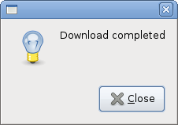
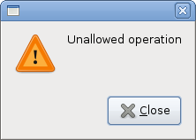
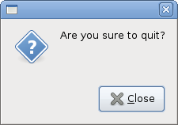
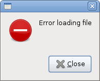
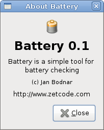
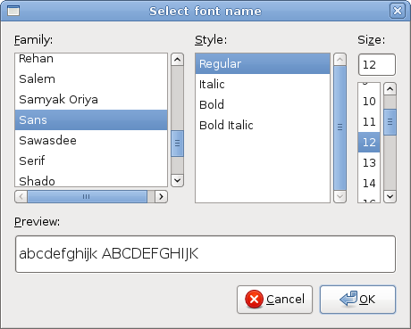
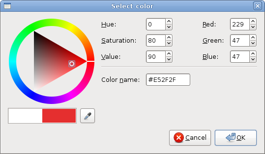

# Dialogs in GTK#

In this part of the GTK# programming tutorial, we will introduce dialogs.


Dialog windows or dialogs are an indispensable part of most modern GUI applications. A dialog is defined as a conversation between two or more persons. In a computer application a dialog is a window which is used to "talk" to the application. A dialog is used to input data, modify data, change the application settings etc. Dialogs are important means of communication between a user and a computer program.

## Message dialogs

Message dialogs are convenient dialogs that provide messages to the user of the application. The message consists of textual and image data.

messages.cs

```csharp
using Gtk;
using System;
 
class SharpApp : Window {
 

    public SharpApp() : base("Messages")
    {
        SetDefaultSize(250, 100);
        SetPosition(WindowPosition.Center);
        DeleteEvent += delegate { Application.Quit(); }; 

        
        Table table = new Table(2, 2, true);
        
        Button info = new Button("Information");
        Button warn = new Button("Warning");
        Button ques = new Button("Question");
        Button erro = new Button("Error");

        info.Clicked += delegate {
            MessageDialog md = new MessageDialog(this, 
                DialogFlags.DestroyWithParent, MessageType.Info, 
                ButtonsType.Close, "Download completed");
            md.Run();
            md.Destroy();
        };

        warn.Clicked += delegate {
            MessageDialog md = new MessageDialog(this, 
                DialogFlags.DestroyWithParent, MessageType.Warning, 
                ButtonsType.Close, "Unallowed operation");
            md.Run();
            md.Destroy();
        };
        
        
        ques.Clicked += delegate {
            MessageDialog md = new MessageDialog(this, 
                DialogFlags.DestroyWithParent, MessageType.Question, 
                ButtonsType.Close, "Are you sure to quit?");
            md.Run();
            md.Destroy();
        };
        
        erro.Clicked += delegate {
            MessageDialog md = new MessageDialog (this, 
                DialogFlags.DestroyWithParent, MessageType.Error, 
                ButtonsType.Close, "Error loading file");
            md.Run();
            md.Destroy();
        };

        table.Attach(info, 0, 1, 0, 1);
        table.Attach(warn, 1, 2, 0, 1);
        table.Attach(ques, 0, 1, 1, 2);
        table.Attach(erro, 1, 2, 1, 2);
        
        Add(table);

        ShowAll();
    }

    public static void Main()
    {
        Application.Init();
        new SharpApp();
        Application.Run();
    }
}
```

In our example, we will show four kinds of message dialogs. Information, Warning, Question, and Error message dialogs.


```csharp
Button info = new Button("Information");
Button warn = new Button("Warning");
Button ques = new Button("Question");
Button erro = new Button("Error");
```

We have four buttons. Each of these buttons will show a different kind of message dialog.

```csharp
info.Clicked += delegate {
    MessageDialog md = new MessageDialog(this, 
        DialogFlags.DestroyWithParent, MessageType.Info, 
        ButtonsType.Close, "Download completed");
    md.Run();
    md.Destroy();
};
```

If we click on the info button, the Information dialog is displayed. The `MessageType.Info` specifies the type of the dialog. The `ButtonsType.Close` specifies the button to be displayed in the dialog. The last parameter is the message displayed. The dialog is displayed with the `Run()` method. The programmer must also call either the `Destroy()` or the `Hide()` method.

   


## AboutDialog

The `AboutDialog` displays information about the application. `AboutDialog` can display a logo, the name of the application, version, copyright, website or licence information. It is also possible to give credits to the authors, documenters, translators and artists.

aboutdialog.cs

```csharp
using Gtk;
using System;
 
class SharpApp : Window {
 

    public SharpApp() : base("About")
    {
        SetDefaultSize(300, 270);
        SetPosition(WindowPosition.Center);
        DeleteEvent += delegate { Application.Quit(); } ;
        
        Button button = new Button("About");
        button.Clicked += OnClicked;
        
        Fixed fix = new Fixed();
        fix.Put(button, 20, 20);
        Add(fix);

        ShowAll();
    }


    void OnClicked(object sender, EventArgs args)
    {
        AboutDialog about = new AboutDialog();
        about.ProgramName = "Battery";
        about.Version = "0.1";
        about.Copyright = "(c) Jan Bodnar";
        about.Comments = @"Battery is a simple tool for 
battery checking";
        about.Website = "http://www.zetcode.com";
        about.Logo = new Gdk.Pixbuf("battery.png");
        about.Run();
        about.Destroy();
    }


    public static void Main()
    {
        Application.Init();
        new SharpApp();
        Application.Run();
    }
}
```

The code example uses a `AboutDialog` with some of its features.

```csharp
AboutDialog about = new AboutDialog();
```

We create an `AboutDialog`.

```csharp
about.ProgramName = "Battery";
about.Version = "0.1";
about.Copyright = "(c) Jan Bodnar";
```

By setting the properties of the dialog, we specify the name, version and the copyright.

```
about.Logo = new Gdk.Pixbuf("battery.png");
```

This line creates a logo.

Figure: AboutDialog


## FontSelectionDialog

The `FontSelectionDialog` is a dialog for selecting fonts. It is typically used in applications that do some text editing or formatting.

fontdialog.cs

```csharp
using Gtk;
using System;
 
class SharpApp : Window {
 
    Label label;

    public SharpApp() : base("Font Selection Dialog")
    {
        SetDefaultSize(300, 220);
        SetPosition(WindowPosition.Center);
        DeleteEvent += delegate { Application.Quit(); } ;
        
        label = new Label("The only victory over love is flight.");
        Button button = new Button("Select font");
        button.Clicked += OnClicked;

        Fixed fix = new Fixed();
        fix.Put(button, 100, 30);
        fix.Put(label, 30, 90);
        Add(fix);

        ShowAll();
    }


    void OnClicked(object sender, EventArgs args)
    {
        FontSelectionDialog fdia = new FontSelectionDialog("Select font name");
        fdia.Response += delegate (object o, ResponseArgs resp) {

            if (resp.ResponseId == ResponseType.Ok) {
               Pango.FontDescription fontdesc = 
                   Pango.FontDescription.FromString(fdia.FontName);
               label.ModifyFont(fontdesc);
            }
        };

        fdia.Run();
        fdia.Destroy();
    }

    public static void Main()
    {
        Application.Init();
        new SharpApp();
        Application.Run();
    }
}
```

In the code example, we have a button and a label. We show the `FontSelectionDialog` by clicking on the button.


```csharp
FontSelectionDialog fdia = new FontSelectionDialog("Select font name");
```

We create the `FontSelectionDialog.`

```csharp
fdia.Response += delegate (object o, ResponseArgs resp) {

    if (resp.ResponseId == ResponseType.Ok) {
        Pango.FontDescription fontdesc = Pango.FontDescription.FromString(fdia.FontName);
        label.ModifyFont(fontdesc);
    }
};
```

If we click on the OK button, the font of the label widget changes to the one that we selected in the dialog.

Figure: FontSelectionDialog


## ColorSelectionDialog

`ColorSelectionDialog` is a dialog for selecting a colour.

colordialog.cs

```csharp
using Gtk;
using System;
 
class SharpApp : Window {
 
    Label label;

    public SharpApp() : base("Color Dialog")
    {
        SetDefaultSize(300, 220);
        SetPosition(WindowPosition.Center);
        DeleteEvent += delegate { Application.Quit(); } ;
        
        label = new Label("The only victory over love is flight.");
        Button button = new Button("Select color");
        button.Clicked += OnClicked;

        Fixed fix = new Fixed();
        fix.Put(button, 100, 30);
        fix.Put(label, 30, 90);
        Add(fix);

        ShowAll();
    }


    void OnClicked(object sender, EventArgs args)
    {
        ColorSelectionDialog cdia = new ColorSelectionDialog("Select color");
        cdia.Response += delegate (object o, ResponseArgs resp) {

            if (resp.ResponseId == ResponseType.Ok) {
               label.ModifyFg(StateType.Normal, cdia.ColorSelection.CurrentColor);
            }
        };

        cdia.Run();
        cdia.Destroy();
    }


    public static void Main()
    {
        Application.Init();
        new SharpApp();
        Application.Run();
    }
}
```

The example is very similar to the previous one. This time we change the colour of the label.

```csharp
ColorSelectionDialog cdia = new ColorSelectionDialog("Select color");
```

We create the `ColorSelectionDialog`.

```csharp
cdia.Response += delegate (object o, ResponseArgs resp) {

    if (resp.ResponseId == ResponseType.Ok) {
    label.ModifyFg(StateType.Normal, cdia.ColorSelection.CurrentColor);
    }
};
```

If the user pressed OK, we get the color and modify the label's colour.

Figure: ColorSelectionDialog


In this part of the GTK# tutorial, we talked about dialogs.

[
Previous](./advancedwidgets.md) [Next](./pango.md)