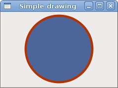
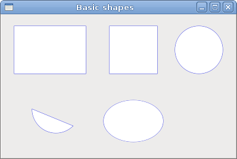
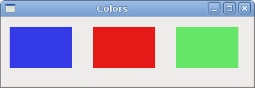
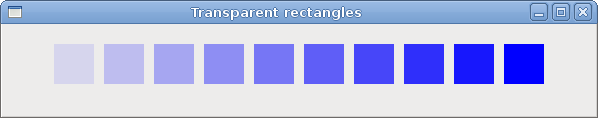
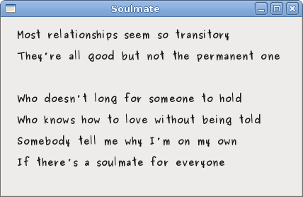

# Drawing with Cairo in GTK#

In this part of the GTK# programming tutorial, we will do some drawing with the Cairo library.


*Cairo* is a library for creating 2D vector graphics. We can use it to draw our own widgets, charts or various effects or animations.

## Simple drawing

The stroke operation draws the outlines of shapes and the fill operation fills the insides of shapes. Next we will demonstrate these two operations.

simpledrawing.cs

```csharp
using Gtk;
using Cairo;
using System;
 
class SharpApp : Window {
 

    public SharpApp() : base("Simple drawing")
    {
        SetDefaultSize(230, 150);
        SetPosition(WindowPosition.Center);
        DeleteEvent += delegate { Application.Quit(); };;
        
        DrawingArea darea = new DrawingArea();
        darea.ExposeEvent += OnExpose;

        Add(darea);

        ShowAll();
    }

    void OnExpose(object sender, ExposeEventArgs args)
    {
        DrawingArea area = (DrawingArea) sender;
        Cairo.Context cr =  Gdk.CairoHelper.Create(area.GdkWindow);
        
        cr.LineWidth = 9;
        cr.SetSourceRGB(0.7, 0.2, 0.0);
                
        int width, height;
        width = Allocation.Width;
        height = Allocation.Height;

        cr.Translate(width/2, height/2);
        cr.Arc(0, 0, (width < height ? width : height) / 2 - 10, 0, 2*Math.PI);
        cr.StrokePreserve();
        
        cr.SetSourceRGB(0.3, 0.4, 0.6);
        cr.Fill();
         
        ((IDisposable) cr.Target).Dispose();                                      
        ((IDisposable) cr).Dispose();
    }

    public static void Main()
    {
        Application.Init();
        new SharpApp();
        Application.Run();
    }
}
```

In our example, we will draw a circle and will it with a solid color.


```csharp
gmcs -pkg:gtk-sharp-2.0 -r:/usr/lib/mono/2.0/Mono.Cairo.dll  simple.cs
```

Here is how we compile the example.

```csharp
DrawingArea darea = new DrawingArea();
```

We will be doing our drawing operations on the `DrawingArea` widget.

```csharp
darea.ExposeEvent += OnExpose;
```

All drawing is done in a method that we plug into the `ExposeEvent`.

```csharp
DrawingArea area = (DrawingArea) sender;
Cairo.Context cr =  Gdk.CairoHelper.Create(area.GdkWindow);
```

We create the `Cairo.Context` object from the `GdkWindow` of the drawing area. The context is an object that is used to draw on all Drawable objects.

```csharp
cr.LineWidth = 9;
```

We set the width of the line to 9 pixels.

```csharp
cr.SetSourceRGB(0.7, 0.2, 0.0);
```

We set the colour to dark red.

```csharp
int width, height;
width = Allocation.Width;
height = Allocation.Height;

cr.Translate(width/2, height/2);
```

We get the width and height of the drawing area. We move the origin into the middle of the window.


```csharp
cr.Arc(0, 0, (width < height ? width : height) / 2 - 10, 0, 2*Math.PI);
cr.StrokePreserve();
```

We draw the outside shape of a circle. The `StrokePreserve()` strokes the current path according to the current line width, line join, line cap, and dash settings. Unlike the `Stroke()`, it preserves the path within the cairo context.

```csharp
cr.SetSourceRGB(0.3, 0.4, 0.6);
cr.Fill();
```

This fills the interior of the circle with some blue colour.

Figure: Simple drawing


## Basic shapes

The next example draws some basic shapes onto the window.

basicshapes.cs

```csharp
using Gtk;
using Cairo;
using System;
 
class SharpApp : Window {
 

    public SharpApp() : base("Basic shapes")
    {
        SetDefaultSize(390, 240);
        SetPosition(WindowPosition.Center);
        DeleteEvent += delegate { Application.Quit(); };
        
        DrawingArea darea = new DrawingArea();
        darea.ExposeEvent += OnExpose;

        Add(darea);
        ShowAll();
    }

    void OnExpose(object sender, ExposeEventArgs args)
    {
        DrawingArea area = (DrawingArea) sender;
        Cairo.Context cc =  Gdk.CairoHelper.Create(area.GdkWindow);
                
        cc.SetSourceRGB(0.2, 0.23, 0.9);
        cc.LineWidth = 1;

        cc.Rectangle(20, 20, 120, 80);
        cc.Rectangle(180, 20, 80, 80);
        cc.StrokePreserve();
        cc.SetSourceRGB(1, 1, 1);
        cc.Fill();

        cc.SetSourceRGB(0.2, 0.23, 0.9);
        cc.Arc(330, 60, 40, 0, 2*Math.PI);
        cc.StrokePreserve();
        cc.SetSourceRGB(1, 1, 1);
        cc.Fill();

        cc.SetSourceRGB(0.2, 0.23, 0.9);
        cc.Arc(90, 160, 40, Math.PI/4, Math.PI);
        cc.ClosePath();
        cc.StrokePreserve();
        cc.SetSourceRGB(1, 1, 1);
        cc.Fill();

        cc.SetSourceRGB(0.2, 0.23, 0.9);
        cc.Translate(220, 180);
        cc.Scale(1, 0.7);        
        cc.Arc(0, 0, 50, 0, 2*Math.PI);
        cc.StrokePreserve();
        cc.SetSourceRGB(1, 1, 1);
        cc.Fill();          

        ((IDisposable) cc.Target).Dispose ();                                      
        ((IDisposable) cc).Dispose ();
    }

    public static void Main()
    {
        Application.Init();
        new SharpApp();
        Application.Run();
    }
}
```

In this example, we will create a rectangle, a square, a circle, an arc, and an ellipse. We draw outlines in blue colour, insides in white.


```csharp
cc.Rectangle(20, 20, 120, 80);
cc.Rectangle(180, 20, 80, 80);
cc.StrokePreserve();
cc.SetSourceRGB(1, 1, 1);
cc.Fill();
```

These lines draw a rectangle and a square.

```csharp
cc.Arc(330, 60, 40, 0, 2*Math.PI);
```

Here the `Arc()` method draws a full circle.

```csharp
cc.Scale(1, 0.7);        
cc.Arc(0, 0, 50, 0, 2*Math.PI);
```

If we want to draw an oval, we do some scaling first. Here the `Scale()` method shrinks the y axis.

Figure: Basic shapes


## Colours

A colour is an object representing a combination of Red, Green, and Blue (RGB) intensity values. Cairo valid RGB values are in the range 0 to 1.

colors.cs

```csharp
using Gtk;
using Cairo;
using System;
 
class SharpApp : Window {
 

    public SharpApp() : base("Colors")
    {
        SetDefaultSize(360, 100);
        SetPosition(WindowPosition.Center);
        DeleteEvent += delegate { Application.Quit(); };
        
        DrawingArea darea = new DrawingArea();
        darea.ExposeEvent += OnExpose;

        Add(darea);

        ShowAll();
    }

    void OnExpose(object sender, ExposeEventArgs args)
    {
        DrawingArea area = (DrawingArea) sender;
        Cairo.Context cr =  Gdk.CairoHelper.Create(area.GdkWindow);
                
        cr.SetSourceRGB(0.2, 0.23, 0.9);
        cr.Rectangle(10, 15, 90, 60);
        cr.Fill();
         
        cr.SetSourceRGB(0.9, 0.1, 0.1);
        cr.Rectangle(130, 15, 90, 60);
        cr.Fill();

        cr.SetSourceRGB(0.4, 0.9, 0.4);
        cr.Rectangle(250, 15, 90, 60);
        cr.Fill();

        ((IDisposable) cr.Target).Dispose();                                      
        ((IDisposable) cr).Dispose();
    }

    public static void Main()
    {
        Application.Init();
        new SharpApp();
        Application.Run();
    }
}
```

We draw three rectangles in three different colours.

```csharp
cr.SetSourceRGB(0.2, 0.23, 0.9);
```

The `SetSourceRGB()` method sets a colour for the cairo context. The three parameters of the method are the colour intensity values.

```csharp
cr.Rectangle(10, 15, 90, 60);
cr.Fill();
```

We create a rectangle shape and fill it with the previously specified colour.

Figure: Colours


## Transparent rectangles

Transparency is the quality of being able to see through a material. The easiest way to understand transparency is to imagine a piece of glass or water. Technically, the rays of light can go through the glass and this way we can see objects behind the glass.

In computer graphics, we can achieve transparency effects using alpha compositing. Alpha compositing is the process of combining an image with a background to create the appearance of partial transparency. The composition process uses an alpha channel. (wikipedia.org, answers.com)

transparentrectangles.cs

```csharp
using Gtk;
using Cairo;
using System;
 

class SharpApp : Window {
 

    public SharpApp() : base("Transparent rectangles")
    {
        SetDefaultSize(590, 90);
        SetPosition(WindowPosition.Center);
        DeleteEvent += delegate { Application.Quit(); } ;
        
        DrawingArea darea = new DrawingArea();
        darea.ExposeEvent += OnExpose;

        Add(darea);

        ShowAll();
    }

    void OnExpose(object sender, ExposeEventArgs args)
    {
        DrawingArea area = (DrawingArea) sender;
        Cairo.Context cr =  Gdk.CairoHelper.Create(area.GdkWindow);

        for ( int i = 1; i <= 10; i++) {
            cr.SetSourceRGBA(0, 0, 1, i*0.1);
            cr.Rectangle(50*i, 20, 40, 40);
            cr.Fill();  
        }

        ((IDisposable) cr.Target).Dispose();                                      
        ((IDisposable) cr).Dispose();
    }

    public static void Main()
    {
        Application.Init();
        new SharpApp();
        Application.Run();
    }
}
```

In the example we will draw ten rectangles with different levels of transparency.

```csharp
cr.SetSourceRGBA(0, 0, 1, i*0.1);
```

The last parameter of the `SetSourceRGBA()` method is the alpha transparency.

Figure: Transparent rectangles


## Soulmate

In the next example, we draw some text on the window.

soulmate.cs

```csharp
using Gtk;
using Cairo;
using System;
 
class SharpApp : Window {
 

    public SharpApp() : base("Soulmate")
    {
        SetDefaultSize(420, 250);
        SetPosition(WindowPosition.Center);
        DeleteEvent += delegate { Application.Quit(); };
        
        DrawingArea darea = new DrawingArea();
        darea.ExposeEvent += OnExpose;

        Add(darea);

        ShowAll();
    }

    void OnExpose(object sender, ExposeEventArgs args)
    {
        DrawingArea area = (DrawingArea) sender;
        Cairo.Context cr =  Gdk.CairoHelper.Create(area.GdkWindow);
        
        cr.SetSourceRGB(0.1, 0.1, 0.1);
         
        cr.SelectFontFace("Purisa", FontSlant.Normal, FontWeight.Bold);
        cr.SetFontSize(13);
       
        cr.MoveTo(20, 30);
        cr.ShowText("Most relationships seem so transitory");
        cr.MoveTo(20, 60);
        cr.ShowText("They're all good but not the permanent one");
        cr.MoveTo(20, 120);
        cr.ShowText("Who doesn't long for someone to hold");
        cr.MoveTo(20, 150);
        cr.ShowText("Who knows how to love without being told");
        cr.MoveTo(20, 180);
        cr.ShowText("Somebody tell me why I'm on my own");
        cr.MoveTo(20, 210);
        cr.ShowText("If there's a soulmate for everyone");

        ((IDisposable) cr.Target).Dispose();                                      
        ((IDisposable) cr).Dispose();
    }

    public static void Main()
    {
        Application.Init();
        new SharpApp();
        Application.Run();
    }
}
```

We display part of the lyrics from the Natasha Bedingfields Soulmate song.

```csharp
cr.SelectFontFace("Purisa", FontSlant.Normal, FontWeight.Bold);
```

Here we specify the font that we use—Purisa bold.

```csharp
cr.SetFontSize(13);
```

We specify the size of the font.

```csharp
cr.MoveTo(20, 30);
```

We move to the point, where we will draw the text.

```
cr.ShowText("Most relationships seem so transitory");
```

The `ShowText()` method draws text onto the window.

Figure: Soulmate


In this chapter of the GTK# programming library, we were drawing with Cairo library.


[Previous](./pango.md) [Next](./drawingII.md)