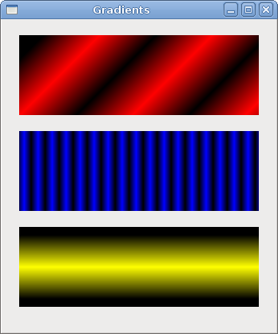
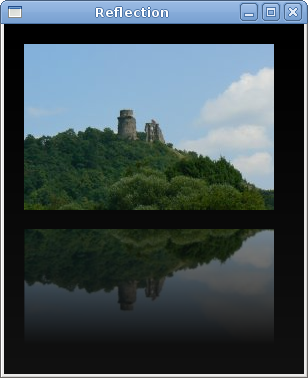
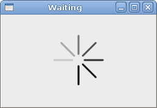

# Drawing with Cairo in GTK# II

In this part of the GTK# programming tutorial, we will continue drawing with the Cairo library.


## Donut

In the following example we create an complex shape by rotating a bunch of ellipses.

donut.cs

```csharp
using Gtk;
using Cairo;
using System;
 
class SharpApp : Window {
 

    public SharpApp() : base("Donut")
    {
        SetDefaultSize(350, 250);
        SetPosition(WindowPosition.Center);
        DeleteEvent += delegate { Application.Quit(); };
        
        DrawingArea darea = new DrawingArea();
        darea.ExposeEvent += OnExpose;

        Add(darea);

        ShowAll();
    }

    void OnExpose(object sender, ExposeEventArgs args)
    {
        DrawingArea area = (DrawingArea) sender;
        Cairo.Context cr =  Gdk.CairoHelper.Create(area.GdkWindow);
                
        cr.LineWidth = 0.5;

        int width, height;
        width = Allocation.Width;
        height = Allocation.Height;
       
        cr.Translate(width/2, height/2);
        cr.Arc(0, 0, 120, 0, 2*Math.PI);
        cr.Stroke();
         
        cr.Save();

        for (int i = 0; i < 36; i++) {
            cr.Rotate( i*Math.PI/36);
            cr.Scale(0.3, 1);
            cr.Arc(0, 0, 120, 0, 2*Math.PI);
            cr.Restore();
            cr.Stroke();
            cr.Save();
        }

        ((IDisposable) cr.Target).Dispose();                                      
        ((IDisposable) cr).Dispose();
    }


    public static void Main()
    {
        Application.Init();
        new SharpApp();
        Application.Run();
    }
}
```

In this example, we create a donut. The shapes resembles a cookie, hence the name donut.


```csharp
cr.Translate(width/2, height/2);
cr.Arc(0, 0, 120, 0, 2*Math.PI);
cr.Stroke();
```

In the beginning there is an ellipse.

```csharp
for (int i = 0; i < 36; i++) {
    cr.Rotate( i*Math.PI/36);
    cr.Scale(0.3, 1);
    cr.Arc(0, 0, 120, 0, 2*Math.PI);
    cr.Restore();
    cr.Stroke();
    cr.Save();
}
```

After several rotations, there is a donut.

Figure: Donut


## Gradients

In computer graphics, gradient is a smooth blending of shades from light to dark or from one colour to another. In 2D drawing programs and paint programs, gradients are used to create colourful backgrounds and special effects as well as to simulate lights and shadows. (answers.com)

gradients.cs

```csharp
using Gtk;
using Cairo;
using System;
 
class SharpApp : Window {
 

    public SharpApp() : base("Gradients")
    {
        SetDefaultSize(340, 390);
        SetPosition(WindowPosition.Center);
        DeleteEvent += delegate { Application.Quit(); };
        
        DrawingArea darea = new DrawingArea();
        darea.ExposeEvent += OnExpose;

        Add(darea);

        ShowAll();
    }

    void OnExpose(object sender, ExposeEventArgs args)
    {
        DrawingArea area = (DrawingArea) sender;
        Cairo.Context cr =  Gdk.CairoHelper.Create(area.GdkWindow);
                
               
        LinearGradient lg1 = new LinearGradient(0.0, 0.0, 350.0, 350.0);
       
        int count = 1;

        for (double j=0.1; j<1.0; j+= 0.1) {
            if (Convert.ToBoolean(count % 2)) {
                lg1.AddColorStop(j, new Color(0, 0, 0, 1));
            } else {
                lg1.AddColorStop(j, new Color(1, 0, 0, 1));
            }
        count++;
        }

        cr.Rectangle(20, 20, 300, 100);
        cr.Pattern = lg1;
        cr.Fill();

        LinearGradient lg2 = new LinearGradient(0.0, 0.0, 350.0, 0);
       
        count = 1;

        for (double i=0.05; i<0.95; i+= 0.025) {
            if (Convert.ToBoolean(count % 2)) {
                lg2.AddColorStop(i, new Color(0, 0, 0, 1));
            } else {
                lg2.AddColorStop(i, new Color(0, 0, 1, 1));
            }
        count++;
        }

        cr.Rectangle(20, 140, 300, 100);
        cr.Pattern = lg2;
        cr.Fill();

        LinearGradient lg3 = new LinearGradient(20.0, 260.0,  20.0, 360.0);
        lg3.AddColorStop(0.1, new Color (0, 0, 0, 1) );
        lg3.AddColorStop(0.5, new Color (1, 1, 0, 1) );
        lg3.AddColorStop(0.9, new Color (0, 0, 0, 1) );

        cr.Rectangle(20, 260, 300, 100);
        cr.Pattern = lg3;
        cr.Fill();
        

        lg1.Destroy();
        lg2.Destroy();
        lg3.Destroy();        

        ((IDisposable) cr.Target).Dispose ();                                      
        ((IDisposable) cr).Dispose ();
    }

    public static void Main()
    {
        Application.Init();
        new SharpApp();
        Application.Run();
    }
}
```

In our example, we draw three rectangles with three different gradients.


```csharp
LinearGradient lg1 = new LinearGradient(0.0, 0.0, 350.0, 350.0);
```

Here we create a linear gradient pattern. The parameters specify the line, along which we draw the gradient. In our case it is a vertical line.

```csharp
LinearGradient lg3 = new LinearGradient(20.0, 260.0,  20.0, 360.0);
lg3.AddColorStop(0.1, new Color (0, 0, 0, 1) );
lg3.AddColorStop(0.5, new Color (1, 1, 0, 1) );
lg3.AddColorStop(0.9, new Color (0, 0, 0, 1) );
```

We define colour stops to produce our gradient pattern. In this case, the gradient is a blending of black and yellow colours. By adding two black and one yellow stops, we create a horizontal gradient pattern. What do these stops actually mean? In our case, we begin with black colour, which will stop at 1/10 of the size. Then we begin to gradually paint in yellow, which will culminate at the centre of the shape. The yellow colour stops at 9/10 of the size, where we begin painting in black again, until the end.

Figure: Gradients


## Puff

In the following example, we create a puff effect. The example will display a growing centered text that will gradually fade out from some point. This is a very common effect, which you can often see in flash animations.

puff.cs

```csharp
using Gtk;
using Cairo;
using System;
 
class SharpApp : Window {
 

    private bool timer = true;
    private double alpha = 1.0;
    private double size = 1.0;
    private DrawingArea darea;
   
    
    public SharpApp() : base("Puff")
    {
        SetDefaultSize(350, 200);
        SetPosition(WindowPosition.Center);
        DeleteEvent += delegate { Application.Quit(); };
        
        GLib.Timeout.Add(14, new GLib.TimeoutHandler(OnTimer));
        
        darea = new DrawingArea();
        darea.ExposeEvent += OnExpose;

        Add(darea);

        ShowAll();
    }
    
    bool OnTimer() 
    { 
        if (!timer) return false;

        darea.QueueDraw();
        return true;
    }      

    void OnExpose(object sender, ExposeEventArgs args)
    {
        DrawingArea area = (DrawingArea) sender;
        Cairo.Context cr =  Gdk.CairoHelper.Create(area.GdkWindow);
              
        int x = Allocation.Width / 2;
        int y = Allocation.Height / 2;

        cr.SetSourceRGB(0.5, 0, 0);
        cr.Paint();

        cr.SelectFontFace("Courier", FontSlant.Normal, FontWeight.Bold);

        size += 0.8;

        if (size > 20) {
            alpha -= 0.01;
        }

        cr.SetFontSize(size);
        cr.SetSourceRGB(1, 1, 1); 
        
        TextExtents extents = cr.TextExtents("ZetCode");

        cr.MoveTo(x - extents.Width/2, y);
        cr.TextPath("ZetCode");
        cr.Clip();
        cr.Stroke();
        cr.PaintWithAlpha(alpha);

        if (alpha <= 0) {
            timer = false;
        }
        
        ((IDisposable) cr.Target).Dispose();                                      
        ((IDisposable) cr).Dispose();
    }


    public static void Main()
    {
        Application.Init();
        new SharpApp();
        Application.Run();
    }
}
```

The example creates a growing and fading text on the window.


```csharp
GLib.Timeout.Add(14, new GLib.TimeoutHandler(OnTimer));
```

Every 14 ms the `OnTimer()` method is called.

```csharp
bool OnTimer() 
{ 
    if (!timer) return false;
    
    darea.QueueDraw();
    return true;
}      
```

In the `OnTimer()` method, we call the `QueueDraw()` method upon the drawing area, which triggers the `ExposeEvent`.

```csharp
int x = Allocation.Width / 2;
int y = Allocation.Height / 2;
```

Coordinates of the middle point.

```csharp
cr.SetSourceRGB(0.5, 0, 0);
cr.Paint();
```

We set the background color to dark red color.

```csharp
size += 0.8;
```

Each cycle, the font size will grow by 0.8 units.

```csharp
if (size > 20) {
    alpha -= 0.01;
}
```

The fading out begins after the font size is bigger than 20.

```csharp
TextExtents extents = cr.TextExtents("ZetCode");
```

We get the text metrics.

```csharp
cr.MoveTo(x - extents.Width/2, y);
```

We use the text metrics to center the text on the window.

```csharp
cr.TextPath("ZetCode");
cr.Clip();
```

We get the path of the text and set the current clip region to it.

```csharp
cr.Stroke();
cr.PaintWithAlpha(alpha);
```

We paint the current path and take alpha value into account.

Figure: Puff


## Reflection

In the next example we show a reflected image. This beautiful effect makes an illusion as if the image was reflected in water.

reflection.cs

```csharp
using Gtk;
using Cairo;
using System;
 
class SharpApp : Window {
 
    private ImageSurface surface;
    private int imageWidth;
    private int imageHeight;
    private int gap;
    private int border;

    public SharpApp() : base("Reflection")
    {
        
        try {
            surface = new ImageSurface("slanec.png");
        } catch {
            Console.WriteLine("File not found");
            Environment.Exit(1);
        } 
        
        imageWidth = surface.Width;
        imageHeight = surface.Height;
        gap = 40;
        border = 20;

        SetDefaultSize(300, 350);
        SetPosition(WindowPosition.Center);
        DeleteEvent += delegate { Application.Quit(); };
        
        DrawingArea darea = new DrawingArea();
        darea.ExposeEvent += OnExpose;

        Add(darea);

        ShowAll();
    }

    void OnExpose(object sender, ExposeEventArgs args)
    {
        DrawingArea area = (DrawingArea) sender;
        Cairo.Context cr =  Gdk.CairoHelper.Create(area.GdkWindow);
                   
        int width = Allocation.Width;
        int height = Allocation.Height;
          
        LinearGradient lg = new LinearGradient(width/2, 0, width/2, height*3);
        lg.AddColorStop(0, new Color(0, 0, 0, 1));
        lg.AddColorStop(height, new Color(0.2, 0.2, 0.2, 1));

        cr.Pattern = lg;
        cr.Paint();
        
        cr.SetSourceSurface(surface, border, border);
        cr.Paint();

        double alpha = 0.7;
        double step = 1.0 / imageHeight;
      
        cr.Translate(0, 2 * imageHeight + gap);
        cr.Scale(1, -1);
        
        int i = 0;
        
       
        while(i < imageHeight) {
            cr.Rectangle(new Rectangle(border, imageHeight-i, imageWidth, 1));

            i++;
            
            cr.Clip();
            cr.SetSource(surface, border, border);

            cr.PaintWithAlpha(alpha-=step);
            cr.ResetClip();
        }
        
         
        ((IDisposable) cr.Target).Dispose();                                      
        ((IDisposable) cr).Dispose();
    }

    public static void Main()
    {
        Application.Init();
        new SharpApp();
        Application.Run();
    }
}
```

The example shows a reflected castle.

```csharp
LinearGradient lg = new LinearGradient(width/2, 0, width/2, height*3);
lg.AddColorStop(0, new Color(0, 0, 0, 1));
lg.AddColorStop(height, new Color(0.2, 0.2, 0.2, 1));

cr.Pattern = lg;
cr.Paint();
```

The background is filled with a gradiet paint. The paint is a smooth blending from black to dark gray.


```csharp
cr.Translate(0, 2 * imageHeight + gap);
cr.Scale(1, -1);
```

This code flips the image and translates it below the original image. The translation operation is necessary, because the scaling operation makes the image upside down and translates the image up. To understand what happens, simply take a photograph and place it on the table. Now flip it.

```csharp
cr.Rectangle(new Rectangle(border, imageHeight-i, imageWidth, 1));

i++;
        
cr.Clip();
cr.SetSource(surface, border, border);

cr.PaintWithAlpha(alpha-=step);
cr.ResetClip();
```

Crucial part of the code. We make the second image transparent. But the transparency is not constant. The image gradually fades out. This is achieved with the `GradientPaint`.

Figure: Reflection


## Waiting

In this examle, we use transparency effect to create a waiting demo. We will draw 8 lines that will gradually fade out creating an illusion that a line is moving. Such effects are often used to inform users, that a lengthy task is going on behind the scenes. An example is streaming video over the internet.

waiting.cs

```csharp
using Gtk;
using Cairo;
using System;
 
class SharpApp : Window {
 

    private double [,] trs = new double[,] {
        { 0.0, 0.15, 0.30, 0.5, 0.65, 0.80, 0.9, 1.0 },
        { 1.0, 0.0,  0.15, 0.30, 0.5, 0.65, 0.8, 0.9 },
        { 0.9, 1.0,  0.0,  0.15, 0.3, 0.5, 0.65, 0.8 },
        { 0.8, 0.9,  1.0,  0.0,  0.15, 0.3, 0.5, 0.65},
        { 0.65, 0.8, 0.9,  1.0,  0.0,  0.15, 0.3, 0.5 },
        { 0.5, 0.65, 0.8, 0.9, 1.0,  0.0,  0.15, 0.3 },
        { 0.3, 0.5, 0.65, 0.8, 0.9, 1.0,  0.0,  0.15 },
        { 0.15, 0.3, 0.5, 0.65, 0.8, 0.9, 1.0,  0.0, }
    };

    private short count = 0;
    private DrawingArea darea;

    public SharpApp() : base("Waiting")
    {
        SetDefaultSize(250, 150);
        SetPosition(WindowPosition.Center);
        DeleteEvent += delegate { Application.Quit(); };
      
        GLib.Timeout.Add(100, new GLib.TimeoutHandler(OnTimer));
      
        darea = new DrawingArea();
        darea.ExposeEvent += OnExpose;

        Add(darea);

        ShowAll();
    }

    bool OnTimer() 
    { 
        count += 1;
        darea.QueueDraw();
        return true;
    }        

      
    void OnExpose(object sender, ExposeEventArgs args)
    {
        DrawingArea area = (DrawingArea) sender;
        Cairo.Context cr =  Gdk.CairoHelper.Create(area.GdkWindow);
        
        cr.LineWidth = 3;
        cr.LineCap = LineCap.Round;

        int width, height;
        width = Allocation.Width;
        height = Allocation.Height;

        cr.Translate(width/2, height/2);

        for (int i = 0; i < 8; i++) {
            cr.SetSourceRGBA(0, 0, 0, trs[count%8, i]);
            cr.MoveTo(0.0, -10.0);
            cr.LineTo(0.0, -40.0);
            cr.Rotate(Math.PI/4);
            cr.Stroke();
        }

        ((IDisposable) cr.Target).Dispose();                                      
        ((IDisposable) cr).Dispose();
    }

    public static void Main()
    {
        Application.Init();
        new SharpApp();
        Application.Run();
    }
}
```

We draw eight lines with eight different alpha values.

```csharp
GLib.Timeout.Add(100, new GLib.TimeoutHandler(OnTimer));
```

We use a timer function to create animation.

```csharp
private double [,] trs = new double[,] {
    { 0.0, 0.15, 0.30, 0.5, 0.65, 0.80, 0.9, 1.0 },
    ...
};
```

This is a two dimensional array of transparency values used in this demo. There are 8 rows, each for one state. Each of the 8 lines will continuosly use these values.

```csharp
cr.LineWidth = 3;
cr.LineCap = LineCap.Round;
```

We make the lines a bit thicker, so that they are better visible. We draw the lines with rouded caps.

```csharp
cr.SetSourceRGBA(0, 0, 0, trs[count%8, i]);
```

Here we define the transparency value for a line.

```csharp
cr.MoveTo(0.0, -10.0);
cr.LineTo(0.0, -40.0);
cr.Rotate(Math.PI/4);
cr.Stroke();
```

These code lines will draw each of the eight lines.

Figure: Waiting


In this chapter of the GTK# programming library, we did some more advanced drawing with the Cairo library.

[
Previous](./drawing.md) [Next](./customwidget.md)