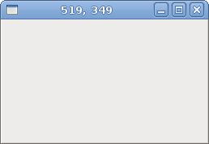
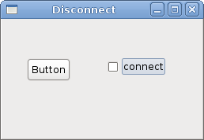

# Events in GTK#

In this part of the GTK# programming tutorial, we will talk about events.

GTK# library is an event driven system. All GUI applications react to events. The applications start a main loop, which continuously checks for newly generated events. If there is no event, the application waits and does nothing. Events are generated mainly by the user of an application. But they can be generated by other means as well, e.g. Internet connection, window manager or a timer.


## Simple event example

The next example shows, how we react to two basic events.

quitbutton.cs

```csharp
using Gtk;
using System;
 
class SharpApp : Window {

    public SharpApp() : base ("Button")
    {
        SetDefaultSize(250, 200);
        SetPosition(WindowPosition.Center);
        
        DeleteEvent += delegate { Application.Quit(); };
        
        Fixed fix = new Fixed();

        Button quit = new Button("Quit");
        quit.Clicked += OnClick;
        quit.SetSizeRequest(80, 35);

        fix.Put(quit, 50, 50);
        Add(fix);
        ShowAll();
    }
    
    void OnClick(object sender, EventArgs args)
    {
        Application.Quit();
    }

    public static void Main()
    {
        Application.Init();
        new SharpApp();
        Application.Run();
    }
}
```

In our code example, we react to two events: Delete event and Clicked event.


The delete event is triggered, when we close the window. By default, the application does not quit, when we click on the close button in the titlebar.

```csharp
DeleteEvent += delegate { Application.Quit(); };
```

When we use the `delegate` keyword, we can write in line code that will react to this particular event.

```csharp
quit.Clicked += OnClick;
```

Here we specify that we react to `Clicked` event, with the `OnClick()` method.

```csharp
void OnClick(object sender, EventArgs args)
{
    Application.Quit();
}
```

Here is the `OnClick()` method. It takes two parameters. The first parameter is the object, which triggered this event. In our case it is the quit button. The second parameter gives us various additional information about the event. The event arguments depend always on the type of the event. The signature of each of the method can be found in the reference manual of the GTK# library. [http://www.go-mono.com/docs/](http://www.go-mono.com/docs/)

## Moving window

The next example shows, how we react to move events of a window. We show the current position of the upper left corner of our window in the titlebar.

move.cs

```csharp
using Gtk;
using System;
 
class SharpApp : Window {
 

    public SharpApp() : base("")
    {
        SetDefaultSize(250, 150);
        SetPosition(WindowPosition.Center);

        DeleteEvent += delegate { Application.Quit(); };
        Show();
    }

    protected override bool OnConfigureEvent(Gdk.EventConfigure args)
    {
        base.OnConfigureEvent(args);
        Title = args.X + ", " + args.Y;
        return true;
    }

    public static void Main()
    {
        Application.Init();
        new SharpApp();
        Application.Run();
    }
}
```

In the previous example, we have plugged a delegate or a method to an event. In GTK#, many of the events have a handler method already. In this case, we can override the method. This is the case, of our code example.


```csharp
protected override bool OnConfigureEvent(Gdk.EventConfigure args)
{
    base.OnConfigureEvent(args);
    Title = args.X + ", " + args.Y;
    return true;
}
```

Here we override the predefined `OnConfigureEvent()` method. Configure event is triggered, when we resize or move a widget. Note that the first line of the method calls the default method. Without this line, the program would not behave correctly. The next line sets the x, y coordinates of the window to the title of the window.

Figure: Move event


## EnterNotifyEvent

`EnterNotifyEvent` is emitted, when we enter the area of a widget with a mouse pointer.

enter.cs

```csharp
using Gtk;
using System;
 
class SharpApp : Window {
 

    public SharpApp() : base("Enter")
    {
        SetDefaultSize(200, 150);
        SetPosition(WindowPosition.Center);

        DeleteEvent += delegate { Application.Quit(); };

        Button button = new Button("Button");
        button.EnterNotifyEvent += OnEnter;

        Fixed fix = new Fixed();
        fix.Put(button, 20, 20);

        Add(fix);

        ShowAll();
    }


    void OnEnter(object sender, EnterNotifyEventArgs args)
    {
        Button button = (Button) sender;
        button.ModifyBg(StateType.Prelight, new Gdk.Color(220, 220, 220));
    }


    public static void Main()
    {
        Application.Init();
        new SharpApp();
        Application.Run();
    }
}
```

We will change the background colour of the button widget, once we hover a mouse pointer over it.

```csharp
button.EnterNotifyEvent += OnEnter;
```

We plug the `OnEnter()` method to to the `EnterNotifyEvent`.

```csharp
Button button = (Button) sender;
button.ModifyBg(StateType.Prelight, new Gdk.Color(220, 220, 220));
```


We get the button widget and modify the colour of its background.

## Disconnecting an event handler

We can disconnect a handler method from an event. Next code example demonstrates such a case.

disconnect.cs

```csharp
using Gtk;
using System;
 
class SharpApp : Window {
 
    Button button;

    public SharpApp() : base("Disconnect")
    {
        SetDefaultSize(250, 150);
        SetPosition(WindowPosition.Center);

        DeleteEvent += delegate { Application.Quit(); };

        button = new Button("Button");

        CheckButton cb = new CheckButton("connect");
        cb.Toggled += OnToggled;

        Fixed fix = new Fixed();
        fix.Put(button, 30, 50);
        fix.Put(cb, 130, 50);

        Add(fix);

        ShowAll();
    }


    void OnClick(object sender, EventArgs args)
    {
        Console.WriteLine("Click");
    }

    void OnToggled(object sender, EventArgs args)
    {
        CheckButton cb = (CheckButton) sender;
        if (cb.Active) {
            button.Clicked += OnClick;
        } else {
            button.Clicked -= OnClick;
        }
    }

    public static void Main()
    {
        Application.Init();
        new SharpApp();
        Application.Run();
    }
}
```

In the code example, we have a button and a check box. We show "Click" text in the console, when we click on the button and the check box is active. The check box connects or disconnects a handler method from the button `Clicked` event.

```csharp
CheckButton cb = new CheckButton("connect");
cb.Toggled += OnToggled;
```

We have a check box. This widget has a `Toggled` event. We plug a `OnToggled()` method to this event.

```csharp
CheckButton cb = (CheckButton) sender;
if (cb.Active) {
    button.Clicked += OnClick;
} else {
    button.Clicked -= OnClick;
}
```

These lines connect or disconnect an event handler, based on the state of the check box widget.

Figure: Disconnect


This chapter was about events in GTK#.

[
Previous](./toolbars.md) [Next](./widgets.md)