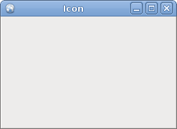
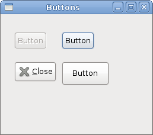

# First steps in GTK#

In this part of the GTK# programming tutorial, we will do our first steps in programming. We will create simple programs.


## Simple example

The first code example is a simple one that shows a centered window.

center.cs

```csharp
using Gtk;
 
class SharpApp : Window {
 
    public SharpApp() : base("Center")
    {
        SetDefaultSize(250, 200);
        SetPosition(WindowPosition.Center);
        
        DeleteEvent += delegate { Application.Quit(); };
        
        Show();    
    }
    
    public static void Main()
    {
        Application.Init();
        new SharpApp();        
        Application.Run();
    }
}
```

The code example shows a small window in the center of the screen.

```csharp
$ gmcs -pkg:gtk-sharp-2.0 center.cs
```

Here is how we compile the code example.

```csharp
using Gtk;
```

Now we can use the objects from the `Gtk` namespace directly. We can write `Window` instead of `Gtk.Window`.

```csharp
class SharpApp : Window {
```

Our application is based on the `SharpApp` class. This class inherits from the `Window` class.

```csharp
public SharpApp() : base("Center")
{
    ...   
}
```

This is the constructor. It builds our application. It also calls its parent constructor through the `base()` keyword.

```csharp
SetDefaultSize(250, 200);
```

This line sets a default size for our window.

```csharp
SetPosition(WindowPosition.Center);
```

This line centers the window on the screen.

```csharp
DeleteEvent += delegate { Application.Quit(); };
```

We plug a delegate to the `DeleteEvent`. This event is triggered, when we click on the close button in the titlebar. Or press Alt+F4. Our delegate quits the application for good.

```csharp
Show();
```

Now we show the window. The window is not visible, until we call the `Show()` method.

```csharp
public static void Main()
{
    Application.Init();
    new SharpApp();        
    Application.Run();
}
```


The `Main()` method is the entry point to the application. It initiates and runs the program.

## Icon

In the next example, we show the application icon. Most window managers display the icon in the left corner of the titlebar and also on the taskbar.

icon.cs

```csharp
using Gtk;
using System;
 
class SharpApp : Window {
 
    public SharpApp() : base("Icon")
    {
        SetDefaultSize(250, 160);
        SetPosition(WindowPosition.Center);
        SetIconFromFile("web.png");
        
        DeleteEvent += new DeleteEventHandler(OnDelete);
        
        Show();      
    }
    
    public static void Main()
    {
        Application.Init();
        new SharpApp();
        Application.Run();
    }

    void OnDelete(object obj, DeleteEventArgs args)
    {
        Application.Quit();
    }
}
```

The code example shows the application icon.

```csharp
SetIconFromFile("web.png");
```

The `SetIconFromFile()` method sets an icon for the window. The image is loaded from disk in the current working directory.

```csharp
DeleteEvent += new DeleteEventHandler(OnDelete);
```

This is another way, how we can plug an event handler to an event. It is just a bit more verbose.

```csharp
void OnDelete(object obj, DeleteEventArgs args)
{
    Application.Quit();
}
```

This is an event handler for the delete event.

Figure: Icon


## Buttons

In the next example, we will further enhance our programming skills with the GTK# library.

buttons.cs

```csharp
using Gtk;
 
class SharpApp : Window
{
    
    public SharpApp() : base("Buttons")
    {
        SetDefaultSize(250, 200);
        SetPosition(WindowPosition.Center);
        
        DeleteEvent += delegate { Application.Quit(); };

        Fixed fix = new Fixed();

        Button btn1 = new Button("Button");
        btn1.Sensitive = false;
        Button btn2 = new Button("Button");
        Button btn3 = new Button(Stock.Close);
        Button btn4 = new Button("Button");
        btn4.SetSizeRequest(80, 40);

        fix.Put(btn1, 20, 30);
        fix.Put(btn2, 100, 30);
        fix.Put(btn3, 20, 80);
        fix.Put(btn4, 100, 80);
        
        Add(fix);
        ShowAll();
    }
    

    public static void Main() 
    {
        Application.Init();
        new SharpApp();
        Application.Run();
    }
}
```

We show four different buttons on the window. We will see a difference between container widgets and child widgets and will change some properties of child widgets.

```csharp
Fixed fix = new Fixed();
```

`Fixed` widget is a non visible container widget. Its purpose is to contain other child widgets.

```csharp
Button btn1 = new Button("Button");
```

A `Button` is a child widget. Child widgets are placed inside containers.

```csharp
btn1.Sensitive = false;
```

We make this button insensitive. This means, we cannot click on it. Graphically the widget is grayed out.

```csharp
Button btn3 = new Button(Stock.Close);
```

The third button shows an image inside its area. The GTK# library has a built-in stock of images that we can use.

```csharp
btn4.SetSizeRequest(80, 40);
```

Here we change the size of the button.

```csharp
fix.Put(btn1, 20, 30);
fix.Put(btn2, 100, 30);
...
```

Here we place button widgets inside fixed container widget.

```csharp
Add(fix);
```

We set the `Fixed` container to be the main container for our `Window` widget.

```csharp
ShowAll();
```

We can either call `ShowAll()` method, or we call `Show()` method on each of the widgets. Including containers.

Figure: Buttons


In this chapter, we created first programs in GTK# programming library.

[Previous](./introduction.md) [Next](./layout.md)