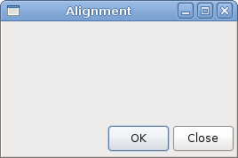

# Layout management in GTK#

In this chapter we will show how to lay out our widgets in windows or dialogs.

When we design the GUI of our application, we decide what widgets we will use and how we will organise those widgets in the application. To organise our widgets, we use specialised non visible widgets called *layout containers*. In this chapter, we will mention `Alignment`, `Fixed`, `VBox` and `Table`.


## Fixed

The `Fixed` container places child widgets at fixed positions and with fixed sizes. This container performs no automatic layout management. In most applications, we do not use this container. There are some specialised areas, where we use it. For example games, specialised applications that work with diagrams, resizable components that can be moved (like a chart in a spreadsheet application), small educational examples.

fixed.cs

```csharp
using Gtk;
using System;
 
class SharpApp : Window {
 
    private Gdk.Pixbuf rotunda;
    private Gdk.Pixbuf bardejov;
    private Gdk.Pixbuf mincol;
    
    public SharpApp() : base("Fixed")
    {
        SetDefaultSize(300, 280);
        SetPosition(WindowPosition.Center);
        ModifyBg(StateType.Normal, new Gdk.Color(40, 40, 40));
        DeleteEvent += delegate { Application.Quit(); };

        try {
            bardejov = new Gdk.Pixbuf("bardejov.jpg");
            rotunda = new Gdk.Pixbuf("rotunda.jpg");
            mincol = new Gdk.Pixbuf("mincol.jpg");
        } catch {
            Console.WriteLine("Images not found");
            Environment.Exit(1);
        }
        
        Image image1 = new Image(bardejov);
        Image image2 = new Image(rotunda);
        Image image3 = new Image(mincol);
        
        
        Fixed fix = new Fixed();
        
        fix.Put(image1, 20, 20);
        fix.Put(image2, 40, 160);
        fix.Put(image3, 170, 50);
  
        Add(fix);
        ShowAll();
    }


    public static void Main()
    {
        Application.Init();
        new SharpApp();
        Application.Run();
    }
}
```

In our example, we show three small images on the window. We explicitly specify the x, y coordinates, where we place these images.


```csharp
ModifyBg(StateType.Normal, new Gdk.Color(40, 40, 40));
```

For better visual experience, we change the background colour to dark gray.

```csharp
bardejov = new Gdk.Pixbuf("bardejov.jpg");
```

We load the image from the disk to the `Gdk.Pixbuf` object.

```csharp
Image image1 = new Image(bardejov);
Image image2 = new Image(rotunda);
Image image3 = new Image(mincol);
```

The `Image` is a widget that is used to display images. It takes `Gdk.Pixbuf` object in the constructor.

```csharp
Fixed fix = new Fixed();
```

We create the `Fixed` container.

```csharp
fix.Put(image1, 20, 20);
```

We place the first image at x=20, y=20 coordinates.

```csharp
Add(fix);
```

Finally, we add the `Fixed` container to the Window.

Figure: Fixed


## Alignment

The `Alignment` container controls the alignment and the size of its child widget.

alignment.cs

```csharp
using Gtk;
using System;
 
class SharpApp : Window {
 

    public SharpApp() : base("Alignment")
    {
        SetDefaultSize(260, 150);
        SetPosition(WindowPosition.Center);
        DeleteEvent += delegate { Application.Quit(); };
        
        VBox vbox = new VBox(false, 5);
        HBox hbox = new HBox(true, 3);
        
        Alignment valign = new Alignment(0, 1, 0, 0);
        vbox.PackStart(valign);
        
        Button ok = new Button("OK");
        ok.SetSizeRequest(70, 30);
        Button close = new Button("Close");
        
        hbox.Add(ok);
        hbox.Add(close);
        
        Alignment halign = new Alignment(1, 0, 0, 0);
        halign.Add(hbox);
        
        vbox.PackStart(halign, false, false, 3);

        Add(vbox);

        ShowAll();
    }


    public static void Main()
    {
        Application.Init();
        new SharpApp();
        Application.Run();
    }
}
```

In the code example, we place two buttons into the right bottom corner of the window. To accomplish this, we use one horizontal box and one vertical box and two alignment containers.

```csharp
Alignment valign = new Alignment(0, 1, 0, 0);
```

This will put the child widget to the bottom.

```csharp
vbox.PackStart(valign);
```

Here we place the `Alignment` widget into the vertical box.

```csharp
HBox hbox = new HBox(true, 3);
...
Button ok = new Button("OK");
ok.SetSizeRequest(70, 30);
Button close = new Button("Close");

hbox.Add(ok);
hbox.Add(close);
```


We create a horizontal box and put two buttons inside it.

```csharp
Alignment halign = new Alignment(1, 0, 0, 0);
halign.Add(hbox);
    
vbox.PackStart(halign, false, false, 3);
```

This will create an alignment container that will place its child widget to the right. We add the horizontal box into the alignment container and pack the alignment container into the vertical box. We must keep in mind that the alignment container takes only one child widget. That is why we must use boxes.

Figure: Alignment


## Table

The `Table` widget arranges widgets in rows and columns.

calculator.cs

```csharp
using Gtk;
using System;
 
class SharpApp : Window {
 

    public SharpApp() : base("Calculator")
    {
        SetDefaultSize(250, 230);
        SetPosition(WindowPosition.Center);
        DeleteEvent += delegate { Application.Quit(); };

        VBox vbox = new VBox(false, 2);
        
        MenuBar mb = new MenuBar();
        Menu filemenu = new Menu();
        MenuItem file = new MenuItem("File");
        file.Submenu = filemenu;
        mb.Append(file);

        vbox.PackStart(mb, false, false, 0);

        Table table = new Table(5, 4, true);

        table.Attach(new Button("Cls"), 0, 1, 0, 1);
        table.Attach(new Button("Bck"), 1, 2, 0, 1);
        table.Attach(new Label(), 2, 3, 0, 1);
        table.Attach(new Button("Close"), 3, 4, 0, 1);

        table.Attach(new Button("7"), 0, 1, 1, 2);
        table.Attach(new Button("8"), 1, 2, 1, 2);
        table.Attach(new Button("9"), 2, 3, 1, 2);
        table.Attach(new Button("/"), 3, 4, 1, 2);

        table.Attach(new Button("4"), 0, 1, 2, 3);
        table.Attach(new Button("5"), 1, 2, 2, 3);
        table.Attach(new Button("6"), 2, 3, 2, 3);
        table.Attach(new Button("*"), 3, 4, 2, 3);

        table.Attach(new Button("1"), 0, 1, 3, 4);
        table.Attach(new Button("2"), 1, 2, 3, 4);
        table.Attach(new Button("3"), 2, 3, 3, 4);
        table.Attach(new Button("-"), 3, 4, 3, 4);

        table.Attach(new Button("0"), 0, 1, 4, 5);
        table.Attach(new Button("."), 1, 2, 4, 5);
        table.Attach(new Button("="), 2, 3, 4, 5);
        table.Attach(new Button("+"), 3, 4, 4, 5);

        vbox.PackStart(new Entry(), false, false, 0);
        vbox.PackEnd(table, true, true, 0);
        
        Add(vbox);
        ShowAll();
    }


    public static void Main()
    {
        Application.Init();
        new SharpApp();
        Application.Run();
    }
}
```

We use the `Table` widget to create a calculator skeleton.

```csharp
Table table = new Table(5, 4, true);
```

We create a table widget with 5 rows and 4 columns. The third parameter is the homogeneous parameter. If set to true, all the widgets in the table are of same size. The size of all widgets is equal to the largest widget in the table container.

```csharp
table.Attach(new Button("Cls"), 0, 1, 0, 1);
```

We attach a button to the table container. To the top-left cell of the table. The first two parameters are the left and right sides of the cell, the last two parameters are the top and left sides of the cell.

```csharp
vbox.PackEnd(table, true, true, 0);
```

We pack the table widget into the vertical box.

Figure: Calculator skeleton


## Windows

Next we will create a more advanced example. We show a window, that can be found in the JDeveloper IDE.

windows.cs

```csharp
using Gtk;
using System;
 
class SharpApp : Window {
 

    public SharpApp() : base("Windows")
    {
        SetDefaultSize(300, 250);
        SetPosition(WindowPosition.Center);
        BorderWidth = 15;
        DeleteEvent += delegate { Application.Quit(); };
        
        Table table = new Table(8, 4, false);
        table.ColumnSpacing = 3;

        Label title = new Label("Windows");

        Alignment halign = new Alignment(0, 0, 0, 0);
        halign.Add(title);
        
        table.Attach(halign, 0, 1, 0, 1, AttachOptions.Fill, 
            AttachOptions.Fill, 0, 0);

        TextView wins = new TextView();
        wins.ModifyFg(StateType.Normal, new Gdk.Color(20, 20, 20));
        wins.CursorVisible = false;
        table.Attach(wins, 0, 2, 1, 3, AttachOptions.Fill | AttachOptions.Expand,
            AttachOptions.Fill | AttachOptions.Expand, 1, 1);

        Button activate = new Button("Activate");
        activate.SetSizeRequest(50, 30);
        table.Attach(activate, 3, 4, 1, 2, AttachOptions.Fill, 
            AttachOptions.Shrink, 1, 1);
        
        Alignment valign = new Alignment(0, 0, 0, 0);
        Button close = new Button("Close");
        close.SetSizeRequest(70, 30);
        valign.Add(close);
        table.SetRowSpacing(1, 3);
        table.Attach(valign, 3, 4, 2, 3, AttachOptions.Fill,
            AttachOptions.Fill | AttachOptions.Expand, 1, 1);
            
        Alignment halign2 = new Alignment(0, 1, 0, 0);
        Button help = new Button("Help");
        help.SetSizeRequest(70, 30);
        halign2.Add(help);
        table.SetRowSpacing(3, 6);
        table.Attach(halign2, 0, 1, 4, 5, AttachOptions.Fill, 
            AttachOptions.Fill, 0, 0);
        
        Button ok = new Button("OK");
        ok.SetSizeRequest(70, 30);
        table.Attach(ok, 3, 4, 4, 5, AttachOptions.Fill, 
            AttachOptions.Fill, 0, 0);
                          
        Add(table);
        ShowAll();
    }

    public static void Main()
    {
        Application.Init();
        new SharpApp();
        Application.Run();
    }
}
```

The code example shows, how we can create a similar window in GTK#.


```csharp
Table table = new Table(8, 4, false);
table.ColumnSpacing = 3;
```

The example is based on the `Table` container. There will be 3 px space between columns.

```csharp
Label title = new Label("Windows");

Alignment halign = new Alignment(0, 0, 0, 0);
halign.Add(title);
    
table.Attach(halign, 0, 1, 0, 1, AttachOptions.Fill, 
    AttachOptions.Fill, 0, 0);
```

This code creates a label that is aligned to the left. The label is placed in the first row of the Table container.

```csharp
TextView wins = new TextView();
wins.ModifyFg(StateType.Normal, new Gdk.Color(20, 20, 20));
wins.CursorVisible = false;
table.Attach(wins, 0, 2, 1, 3, AttachOptions.Fill | AttachOptions.Expand,
    AttachOptions.Fill | AttachOptions.Expand, 1, 1);
```

The text view widget spans two rows and two columns. We make the widget non editable and hide the cursor.

```csharp
Alignment valign = new Alignment(0, 0, 0, 0);
Button close = new Button("Close");
close.SetSizeRequest(70, 30);
valign.Add(close);
table.SetRowSpacing(1, 3);
table.Attach(valign, 3, 4, 2, 3, AttachOptions.Fill,
    AttachOptions.Fill | AttachOptions.Expand, 1, 1);
```

We put the close button next to the text view widget into the fourth column. (we count from zero) We add the button into the alignment widget, so that we can align it to the top.

Figure: Windows


In this chapter, we have covered the layout management of GTK# widgets.

[Previous](./firststeps.md) [Next](./menus.md)