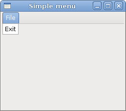
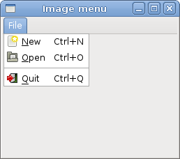
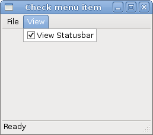
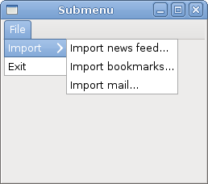

# Menus in GTK#

In this part of the GTK# programming tutorial, we will work with menus.

A *menubar* is one of the most common parts of the GUI application. It is a group of commands located in various menus. While in console applications we have to remember various arcane commands, here we have most of the commands grouped into logical parts. These are accepted standards that further reduce the amount of time spending to learn a new application.


## Simple menu

In our first example, we will create a menubar with one file menu. The menu will have only one menu item. By selecting the item the application quits.

simplemenu.cs

```csharp
using Gtk;
using System;
 
class SharpApp : Window {
 

    public SharpApp() : base("Simple menu")
    {
        SetDefaultSize(250, 200);
        SetPosition(WindowPosition.Center);
        DeleteEvent += delegate { Application.Quit(); };
        
        MenuBar mb = new MenuBar();

        Menu filemenu = new Menu();
        MenuItem file = new MenuItem("File");
        file.Submenu = filemenu;
       
        MenuItem exit = new MenuItem("Exit");
        exit.Activated += OnActivated;
        filemenu.Append(exit);

        mb.Append(file);

        VBox vbox = new VBox(false, 2);
        vbox.PackStart(mb, false, false, 0);

        Add(vbox);

        ShowAll();
    }

    void OnActivated(object sender, EventArgs args)
    {
        Application.Quit();
    }

    public static void Main()
    {
        Application.Init();
        new SharpApp();
        Application.Run();
    }
}
```

This is a small example with minimal menubar functionality.

```csharp
MenuBar mb = new MenuBar();
```

`MenuBar` widget is created.

```csharp
Menu filemenu = new Menu();
MenuItem file = new MenuItem("File");
file.Submenu = filemenu;
```

Toplevel `MenuItem` is created.

```csharp
MenuItem exit = new MenuItem("Exit");
exit.Activated += OnActivated;
filemenu.Append(exit);
```

Exit `MenuItem` is created and appended to the File `MenuItem`.

```csharp
mb.Append(file);
```

Toplevel `MenuItem` is appended to the `MenuBar` widget.

```csharp
VBox vbox = new VBox(false, 2);
vbox.PackStart(mb, false, false, 0);
```


Unlike in other toolkits, we have to take care of the layout management ourselves. We put the menubar into the vertical box.

Figure: Simple menu


## Image menu

In the next example, we will further explore the menus. We will add images and accelerators to our menu items. *Accelerators* are keyboard shortcuts for activating a menu item.

imagemenu.cs

```csharp
using Gtk;
using System;
 
class SharpApp : Window {
 

    public SharpApp() : base("Image menu")
    {
        SetDefaultSize(250, 200);
        SetPosition(WindowPosition.Center);
        DeleteEvent += delegate { Application.Quit(); };
        
        MenuBar mb = new MenuBar();

        Menu filemenu = new Menu();
        MenuItem file = new MenuItem("File");
        file.Submenu = filemenu;
       
        AccelGroup agr = new AccelGroup();
        AddAccelGroup(agr);

        ImageMenuItem newi = new ImageMenuItem(Stock.New, agr);
        newi.AddAccelerator("activate", agr, new AccelKey(
            Gdk.Key.n, Gdk.ModifierType.ControlMask, AccelFlags.Visible));
        filemenu.Append(newi);

        ImageMenuItem open = new ImageMenuItem(Stock.Open, agr);
        open.AddAccelerator("activate", agr, new AccelKey(
            Gdk.Key.n, Gdk.ModifierType.ControlMask, AccelFlags.Visible));
        filemenu.Append(open);

        SeparatorMenuItem sep = new SeparatorMenuItem();
        filemenu.Append(sep);

        ImageMenuItem exit = new ImageMenuItem(Stock.Quit, agr);
        exit.AddAccelerator("activate", agr, new AccelKey(
            Gdk.Key.q, Gdk.ModifierType.ControlMask, AccelFlags.Visible));

        exit.Activated += OnActivated;
        filemenu.Append(exit);

        mb.Append(file);

        VBox vbox = new VBox(false, 2);
        vbox.PackStart(mb, false, false, 0);
        vbox.PackStart(new Label(), false, false, 0);

        Add(vbox);

        ShowAll();
    }

    void OnActivated(object sender, EventArgs args)
    {
        Application.Quit();
    }


    public static void Main()
    {
        Application.Init();
        new SharpApp();
        Application.Run();
    }
}
```

Our example shows a toplevel menu item with three sublevel menu items. Each of the menu items has a image and an accelerator. The accelerator for the quit menu item is active.


```csharp
AccelGroup agr = new AccelGroup();
AddAccelGroup(agr);
```

To work with accelerators, we create a global `AccelGroup` object. It will be used later.

```csharp
ImageMenuItem newi = new ImageMenuItem(Stock.New, agr);
```

`ImageMenuItem` is created. The image comes from the stock of images.

```csharp
exit.AddAccelerator("activate", agr, new AccelKey(
    Gdk.Key.q, Gdk.ModifierType.ControlMask, AccelFlags.Visible));
```

This creates an Ctrl+Q accelerator for the exit menu item.

```csharp
SeparatorMenuItem sep = new SeparatorMenuItem();
filemenu.Append(sep);
```

These lines create a separator. It is used to group menu items into logical groups.

Figure: Image menu


## CheckMenuItem

A `CheckMenuItem` is a menu item with a check box. It can be used to work with boolean properties.

checkmenuitem.cs

```csharp
using Gtk;
using System;
 
class SharpApp : Window {
 
    private Statusbar statusbar;

    public SharpApp() : base("Check menu item")
    {
        SetDefaultSize(250, 200);
        SetPosition(WindowPosition.Center);
        DeleteEvent += delegate { Application.Quit(); };
        
        MenuBar mb = new MenuBar();

        Menu filemenu = new Menu();
        MenuItem file = new MenuItem("File");
        file.Submenu = filemenu;

        Menu viewmenu = new Menu();
        MenuItem view = new MenuItem("View");
        view.Submenu = viewmenu;

        CheckMenuItem stat = new CheckMenuItem("View Statusbar");
        stat.Toggle();
        stat.Toggled += OnStatusView;
        viewmenu.Append(stat);
       
        MenuItem exit = new MenuItem("Exit");
        exit.Activated += OnActivated;
        filemenu.Append(exit);

        mb.Append(file);
        mb.Append(view);

        statusbar = new Statusbar();
        statusbar.Push(1, "Ready");

        VBox vbox = new VBox(false, 2);
        vbox.PackStart(mb, false, false, 0);
        vbox.PackStart(new Label(), true, false, 0);
        vbox.PackStart(statusbar, false, false, 0);

        Add(vbox);

        ShowAll();
    }

    void OnStatusView(object sender, EventArgs args)
    {
        CheckMenuItem item = (CheckMenuItem) sender;

        if (item.Active) {
            statusbar.Show();
        } else {
            statusbar.Hide();
        }
    }
 
    void OnActivated(object sender, EventArgs args)
    {
        Application.Quit();
    }

    public static void Main()
    {
        Application.Init();
        new SharpApp();
        Application.Run();
    }
}
```

In our code example we show a check menu item. If the check box is activated, the statusbar widget is shown. If not, the statusbar is hidden.


```csharp
CheckMenuItem stat = new CheckMenuItem("View Statusbar");
```

`CheckMenuItem` widget is created.

```csharp
stat.Toggle();
```

The `Toggle()` method checks/unchecks the check menu item.

```csharp
if (item.Active) {
    statusbar.Show();
} else {
    statusbar.Hide();
}
```

Depending on the state of the `CheckMenuItem`, we show or hide the statusbar widget.

Figure: CheckMenuItem


## Submenu

Our final example demonstrates how to create a submenu in GTK#.

submenu.cs

```csharp
using Gtk;
using System;
 
class SharpApp : Window {
 

    public SharpApp() : base("Submenu")
    {
        SetDefaultSize(250, 200);
        SetPosition(WindowPosition.Center);
        DeleteEvent += delegate { Application.Quit(); };
        
        MenuBar mb = new MenuBar();

        Menu filemenu = new Menu();
        MenuItem file = new MenuItem("File");
        file.Submenu = filemenu;

        // submenu creation
        Menu imenu = new Menu();

        MenuItem import = new MenuItem("Import");
        import.Submenu = imenu;

        MenuItem inews = new MenuItem("Import news feed...");
        MenuItem ibookmarks = new MenuItem("Import bookmarks...");
        MenuItem imail = new MenuItem("Import mail...");

        imenu.Append(inews);
        imenu.Append(ibookmarks);
        imenu.Append(imail);

        // exit menu item
        MenuItem exit = new MenuItem("Exit");
        exit.Activated += OnActivated;
       
        filemenu.Append(import);
        filemenu.Append(exit);
        mb.Append(file);

        VBox vbox = new VBox(false, 2);
        vbox.PackStart(mb, false, false, 0);
        vbox.PackStart(new Label(), false, false, 0);

        Add(vbox);

        ShowAll();
    }

    void OnActivated(object sender, EventArgs args)
    {
        Application.Quit();
    }

    public static void Main()
    {
        Application.Init();
        new SharpApp();
        Application.Run();
    }
}
```

Submenu creation.

```csharp
Menu imenu = new Menu();
```

A submenu is a `Menu`.

```csharp
MenuItem import = new MenuItem("Import");
import.Submenu = imenu;
```

It is a submenu of a menu item, which belogs to toplevel file menu.

```csharp
MenuItem inews = new MenuItem("Import news feed...");
MenuItem ibookmarks = new MenuItem("Import bookmarks...");
MenuItem imail = new MenuItem("Import mail...");

imenu.Append(inews);
imenu.Append(ibookmarks);
imenu.Append(imail);
```

Submenu has its own menu items.

Figure: Submenu


In this chapter of the GTK# programming library, we showed, how to work with menus.


[Previous](./layout.md) [Next](./toolbars.md)