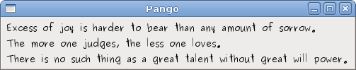
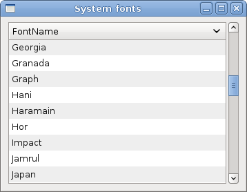
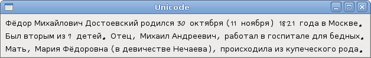
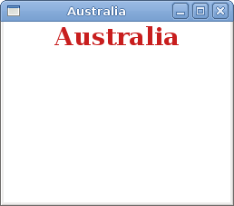

# Pango

In this part of the GTK# programming tutorial, we will explore the Pango library.


Pango is a free and open source computing library for rendering internationalised texts in high quality. Different font backends can be used, allowing cross-platform support. (wikipedia)

Pango provides advanced font and text handling that is used for Gdk and Gtk.

## Simple example

In our first example, we show, how to change font for our label widget.

quotes.cs

```csharp
using Gtk;
using System;
 
class SharpApp : Window {
 
    private Label label;

    public SharpApp() : base("Pango")
    {
        SetPosition(WindowPosition.Center);
        DeleteEvent += delegate { Application.Quit(); };
        
        string text = @"Excess of joy is harder to bear than any amount of sorrow.
The more one judges, the less one loves.
There is no such thing as a great talent without great will power. ";
       
        label = new Label(text);

        Pango.FontDescription fontdesc = Pango.FontDescription.FromString("Purisa 10");
        label.ModifyFont(fontdesc);

        Fixed fix = new Fixed();

        fix.Put(label, 5, 5);
        Add(fix);
        ShowAll();
    }


    public static void Main()
    {
        Application.Init();
        new SharpApp();
        Application.Run();
    }
}
```

In the above code example, we have a label widget with three quotations. We change its font to Purisa 10.


```csharp
string text = @"Excess of joy is harder to bear than any amount of sorrow.
...
```

This is the text to show in the label.

```csharp
Pango.FontDescription fontdesc = Pango.FontDescription.FromString("Purisa 10");
```

The `FontDescription` is used to specify the characteristics of a font to load. The `FromString()` method creates a new font description from a string representation.

```csharp
label.ModifyFont(fontdesc);
```

We change the font of the label widget to Purisa 10.

Figure: Quotations


## System fonts

The next code example shows all available fonts in a `TreeView` widget.

systemfonts.cs

```csharp
using System;
using Pango;
using Gtk;


public class SharpApp : Window
{
    ListStore store;
    FontFamily[] fam;

    public SharpApp() : base("System fonts")
    {
        BorderWidth = 8;

        SetDefaultSize(350, 250);
        SetPosition(WindowPosition.Center);
        DeleteEvent += delegate { Application.Quit(); };


        ScrolledWindow sw = new ScrolledWindow();
        sw.ShadowType = ShadowType.EtchedIn;
        sw.SetPolicy(PolicyType.Automatic, PolicyType.Automatic);

        Context context = this.CreatePangoContext();
        fam = context.Families;

        store = CreateModel();

        TreeView treeView = new TreeView(store);
        treeView.RulesHint = true;
        sw.Add(treeView);

        CreateColumn(treeView);

        Add(sw);
        ShowAll();
    }

    void CreateColumn(TreeView treeView)
    {
        CellRendererText rendererText = new CellRendererText();
        TreeViewColumn column = new TreeViewColumn("FontName",
            rendererText, "text", Column.FontName);
        column.SortColumnId = (int) Column.FontName;
        treeView.AppendColumn(column);
    }


    ListStore CreateModel()
    {
        ListStore store = new ListStore( typeof(string) );

        foreach (FontFamily ff in fam) {
            store.AppendValues(ff.Name);
        }

        return store;
    }

    enum Column
    {
        FontName
    }

  
    public static void Main()
    {
        Application.Init();
        new SharpApp();
        Application.Run();
    }
}
```

The code example shows all available fonts on a system.

```csharp
Context context = this.CreatePangoContext();
```

This code line creates a `Pango.Context` object. It contains global information about the rendering process of text.

```csharp
fam = context.Families;
```

From the context object, we retrieve all available font families.

```csharp
foreach (FontFamily ff in fam) {
    store.AppendValues(ff.Name);
}
```


During the model creation of the `TreeView` widget, we get all font names from the array of font families and put them into the list store.

Figure: System fonts


## Unicode

Pango is used to work with internationalised text.

unicode.cs

```csharp
using Gtk;
using System;
 
class SharpApp : Window {


    public SharpApp() : base("Unicode")
    {
        SetPosition(WindowPosition.Center);
        DeleteEvent += delegate { Application.Quit(); };
        
        string text = @"Фёдор Михайлович Достоевский родился 30 октября (11 ноября)
1821 года в Москве.Был вторым из 7 детей. Отец, Михаил Андреевич, работал в 
госпитале для бедных. Мать, Мария Фёдоровна (в девичестве Нечаева),
происходила из купеческого рода.";
       
        Label label = new Label(text);

        Pango.FontDescription fontdesc = Pango.FontDescription.FromString("Purisa 10");
        label.ModifyFont(fontdesc);

        Fixed fix = new Fixed();

        fix.Put(label, 5, 5);
        Add(fix);
        ShowAll();
    }


    public static void Main()
    {
        Application.Init();
        new SharpApp();
        Application.Run();
    }
}
```

We show some text in azbuka.

```csharp
string text = @"Фёдор Михайлович Достоевский родился 30 октября ...
```

We can directly use the unicode text.

```csharp
Label label = new Label(text);
```

We normally use it in the label widget.

Figure: Unicode


## Coloured text

In the final example, we will further explore Pango capabilities. We will draw a centered, coloured text on a `DrawingArea` widget.

coloured.cs

```csharp
using System;
using Gtk;
using Pango;


public class SharpApp : Window
{

    public SharpApp () : base ("Australia")
    {
        SetDefaultSize(250, 200);
        SetPosition(WindowPosition.Center);
        DeleteEvent += delegate { Application.Quit(); };

        Gdk.Color white = new Gdk.Color(255, 255, 255);

        DrawingArea drawingArea = new DrawingArea();
        drawingArea.ModifyBg(StateType.Normal, white);
        drawingArea.ExposeEvent += OnExposeEvent;

        Add(drawingArea);

        ShowAll();
    }

    void OnExposeEvent (object sender, ExposeEventArgs a)
    {
        DrawingArea drawingArea = sender as DrawingArea;

        int width = drawingArea.Allocation.Width;

        Gdk.PangoRenderer renderer = Gdk.PangoRenderer.GetDefault(drawingArea.Screen);
        renderer.Drawable = drawingArea.GdkWindow;
        renderer.Gc = drawingArea.Style.BlackGC;
        
        Context context = drawingArea.CreatePangoContext();
        Pango.Layout layout = new Pango.Layout(context);
        
        layout.Width = Pango.Units.FromPixels(width);
        layout.SetText("Australia");
        
        FontDescription desc = FontDescription.FromString("Serif Bold 20");
        layout.FontDescription = desc;

        renderer.SetOverrideColor(RenderPart.Foreground, new Gdk.Color(200, 30, 30));
        layout.Alignment = Pango.Alignment.Center;
        renderer.DrawLayout(layout, 0, 0);
        
        renderer.SetOverrideColor(RenderPart.Foreground, Gdk.Color.Zero);
        renderer.Drawable = null;
        renderer.Gc = null;
    }
    
    public static void Main()
    {
        Application.Init();
        new SharpApp();
        Application.Run();
    }
}
```

We draw "Australia" text, horizontally centered, coloured in dark red colour.


```csharp
Gdk.PangoRenderer renderer = Gdk.PangoRenderer.GetDefault(drawingArea.Screen);
renderer.Drawable = drawingArea.GdkWindow;
renderer.Gc = drawingArea.Style.BlackGC;
```

We get the default renderer for the screen, and set it up for drawing.

```csharp
Context context = drawingArea.CreatePangoContext();
Pango.Layout layout = new Pango.Layout(context);
```

We create a `Pango.Layout`. It is a high level driver for laying out entire blocks of text.

```csharp
layout.Width = Pango.Units.FromPixels(width);
```

We specify the layouts width.

```csharp
layout.SetText("Australia");
```

We set our text.

```csharp
FontDescription desc = FontDescription.FromString("Serif Bold 20");
layout.FontDescription = desc;
```

We specify a font for our layout.

```csharp
renderer.SetOverrideColor(RenderPart.Foreground, new Gdk.Color(200, 30, 30));
layout.Alignment = Pango.Alignment.Center;
```

We set a color and alignment.

```csharp
renderer.DrawLayout(layout, 0, 0);
```

We draw the Pango layout.

```csharp
renderer.SetOverrideColor(RenderPart.Foreground, Gdk.Color.Zero);
renderer.Drawable = null;
renderer.Gc = null;
```

We clean up resources.

Figure: Australia


In this chapter of the GTK# programming library, we worked with Pango library.

[Previous](./dialogs.md) [Next](./drawing.md)