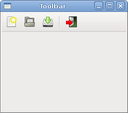
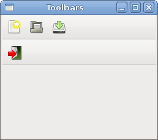
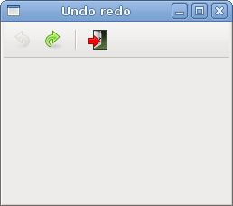

# Toolbars in GTK#

In this part of the GTK# programming tutorial, we will work with toolbars.

Menus group commands that we can use in application. Toolbars provide a quick access to the most frequently used commands. A toolbar is a horizontal or vertical panel with buttons. These buttons have images or images and text. By clicking on the toolbar button we perform an action.


## Simple toolbar

Next we create a simple toolbar.

toolbar.cs

```csharp
using Gtk;
using System;
 
class SharpApp : Window {
 

    public SharpApp() : base("Toolbar")
    {
        SetDefaultSize(250, 200);
        SetPosition(WindowPosition.Center);
        DeleteEvent += delegate { Application.Quit(); };
        
        Toolbar toolbar = new Toolbar();
        toolbar.ToolbarStyle = ToolbarStyle.Icons;

        ToolButton newtb = new ToolButton(Stock.New);
        ToolButton opentb = new ToolButton(Stock.Open);
        ToolButton savetb = new ToolButton(Stock.Save);
        SeparatorToolItem sep = new SeparatorToolItem();
        ToolButton quittb = new ToolButton(Stock.Quit);

        toolbar.Insert(newtb, 0);
        toolbar.Insert(opentb, 1);
        toolbar.Insert(savetb, 2);
        toolbar.Insert(sep, 3);
        toolbar.Insert(quittb, 4);

        quittb.Clicked += OnClicked;
         
        VBox vbox = new VBox(false, 2);
        vbox.PackStart(toolbar, false, false, 0);
        
        Add(vbox);

        ShowAll();
    }

    void OnClicked(object sender, EventArgs args)
    {
        Application.Quit();
    }

    public static void Main()
    {
        Application.Init();
        new SharpApp();
        Application.Run();
    }
}
```

The example shows a toolbar and four tool buttons.

```csharp
Toolbar toolbar = new Toolbar();
```

A `Toolbar` widget is created.

```csharp
toolbar.ToolbarStyle = ToolbarStyle.Icons;
```

On toolbar, we show only icons. No text.

```csharp
ToolButton newtb = new ToolButton(Stock.New);
```

A `ToolButton` with an image from stock is created.

```csharp
SeparatorToolItem sep = new SeparatorToolItem(); 
```

This is a separator. It can be used to group toolbar buttons into logical groups.

```csharp
toolbar.Insert(newtb, 0);
toolbar.Insert(opentb, 1);
...
```


Toolbar buttons are inserted into the toolbar widget.

Figure: Toolbar


## Toolbars

In the second example, we show two toolbars. Many applications have more than one toolbar. We show, how we can do it in GTK#.

toolbars.cs

```csharp
using Gtk;
using System;
 
class SharpApp : Window {
 

    public SharpApp() : base("Toolbars")
    {
        SetDefaultSize(250, 200);
        SetPosition(WindowPosition.Center);
        DeleteEvent += delegate { Application.Quit(); };
        
        Toolbar upper = new Toolbar();
        upper.ToolbarStyle = ToolbarStyle.Icons;

        ToolButton newtb = new ToolButton(Stock.New);
        ToolButton opentb = new ToolButton(Stock.Open);
        ToolButton savetb = new ToolButton(Stock.Save);

        upper.Insert(newtb, 0);
        upper.Insert(opentb, 1);
        upper.Insert(savetb, 2);

        Toolbar lower = new Toolbar();
        lower.ToolbarStyle = ToolbarStyle.Icons;

        ToolButton quittb = new ToolButton(Stock.Quit);
        quittb.Clicked += OnClicked;
        lower.Insert(quittb, 0);

         
        VBox vbox = new VBox(false, 2);
        vbox.PackStart(upper, false, false, 0);
        vbox.PackStart(lower, false, false, 0);

        Add(vbox);

        ShowAll();
    }

    void OnClicked(object sender, EventArgs args)
    {
        Application.Quit();
    }


    public static void Main()
    {
        Application.Init();
        new SharpApp();
        Application.Run();
    }
}
```

Our applications shows two toolbars.

```csharp
Toolbar upper = new Toolbar();
...
Toolbar lower = new Toolbar();
```

We create two `Toolbar` widgets.

```csharp
upper.Insert(newtb, 0);
...
lower.Insert(quittb, 0);
```

Each of them has its own tool buttons.

```csharp
VBox vbox = new VBox(false, 2);
vbox.PackStart(upper, false, false, 0);
vbox.PackStart(lower, false, false, 0)
```

Toolbars are packed into the vertical box, one after the other.

Figure: Toolbars


## Undo redo

The following example demonstrates, how we can inactivate toolbar buttons on the toolbar. It is a common practise in GUI programming. For example the save button. If we save all changes of our document to the disk, the save button is inactivated in most text editors. This way the application indicates to the user, that all changes are already saved.

undoredo.cs

```csharp
using Gtk;
using System;
 
class SharpApp : Window {
 
    private int count = 2;
    private ToolButton undo;
    private ToolButton redo;

    public SharpApp() : base("Undo redo")
    {
        SetDefaultSize(250, 200);
        SetPosition(WindowPosition.Center);
        DeleteEvent += delegate { Application.Quit(); };
        
        Toolbar toolbar = new Toolbar();
        toolbar.ToolbarStyle = ToolbarStyle.Icons;

        undo = new ToolButton(Stock.Undo);
        redo = new ToolButton(Stock.Redo);
        SeparatorToolItem sep = new SeparatorToolItem();
        ToolButton quit = new ToolButton(Stock.Quit);

        toolbar.Insert(undo, 0);
        toolbar.Insert(redo, 1);
        toolbar.Insert(sep, 2);
        toolbar.Insert(quit, 3);

        undo.Clicked += OnUndo;
        redo.Clicked += OnRedo;
        quit.Clicked += OnClicked;
         
        VBox vbox = new VBox(false, 2);
        vbox.PackStart(toolbar, false, false, 0);
        vbox.PackStart(new Label(), false, false, 0);

        Add(vbox);

        ShowAll();
    }

    void OnUndo(object sender, EventArgs args)
    {
        count -= 1;

        if (count <= 0) {
            undo.Sensitive = false;
            redo.Sensitive = true;
        }
    }

    void OnRedo(object sender, EventArgs args)
    {
        count += 1;

        if (count >= 5) {
            redo.Sensitive = false;
            undo.Sensitive = true;
        }
    }

    void OnClicked(object sender, EventArgs args)
    {
        Application.Quit();
    }

    public static void Main()
    {
        Application.Init();
        new SharpApp();
        Application.Run();
    }
}
```

Our example creates undo and redo buttons from the GTK# stock resources. After several clicks each of the buttons is inactivated. The buttons are grayed out.

```csharp
private int count = 2;
```

The count variable decides, which button is activated and deactivated.

```csharp
undo = new ToolButton(Stock.Undo);
redo = new ToolButton(Stock.Redo);
```

We have two tool buttons. Undo and redo tool buttons. Images come from the stock resources.

```csharp
undo.Clicked += OnUndo;
redo.Clicked += OnRedo;
```

We plug a method for the `Clicked` event for both tool buttons.

```csharp
if (count <= 0) {
    undo.Sensitive = false;
    redo.Sensitive = true;
}
```

To activate a widget, we set its `Sensitive` property to true. To inactivate it, we set it to false.

Figure: Undo redo


In this chapter of the GTK# programming library, we mentioned toolbars.

[Previous](./menus.md) [Next](./events.md)