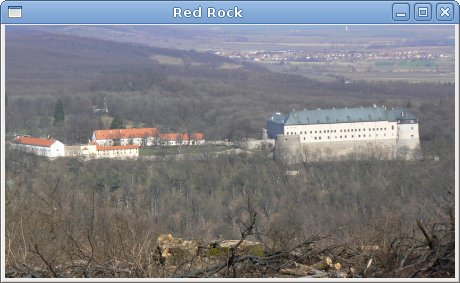

# Widgets in GTK#

In this part of the GTK# programming tutorial, we will introduce some GTK# widgets.

Widgets are basic building blocks of a GUI application. Over the years, several widgets became a standard in all toolkits on all OS platforms. For example a button, a check box or a scroll bar. The GTK# toolkit's philosophy is to keep the number of widgets at a minimum level. More specialised widgets are created as custom GTK# widgets.

## Label

The `Label` widget shows text.

label.cs

```csharp
using Gtk;
 
class SharpApp : Window {
 
   string text = @"Meet you downstairs in the bar and heard
your rolled up sleeves and your skull t-shirt
You say why did you do it with him today?
and sniff me out like I was Tanqueray

cause you're my fella, my guy
hand me your stella and fly
by the time I'm out the door
you tear men down like Roger Moore

I cheated myself
like I knew I would
I told ya, I was trouble
you know that I'm no good";


    public SharpApp() : base("You know I'm No Good")
    {
        BorderWidth = 8;
        SetPosition(WindowPosition.Center);
        
        DeleteEvent += delegate { Application.Quit(); };

        Label lyrics = new Label(text);
        Add(lyrics);
        
        ShowAll();
    }

    public static void Main()
    {
        Application.Init();
        new SharpApp();
        Application.Run();
    }
}
```

The code example shows some lyrics on the window.

```csharp
    string text = @"Meet you downstairs in the bar and heard
your rolled up sleeves and your skull t-shirt
...
```

In C# programming language, multiline string is preceded with the `@` character.

```csharp
BorderWidth = 8;
```

The `Label` is surrounded by some empty space.

```csharp
Label lyrics = new Label(text);
Add(lyrics);
```

The `Label` widget is created and added to the window.

Figure: Label Widget


## CheckButton

`CheckButton` is a widget that has two states: on and off. The On state is visualised by a check mark. It is used to denote some boolean property.

checkbutton.cs

```csharp
using Gtk;
using System;
 
class SharpApp : Window {
 

    public SharpApp() : base("CheckButton")
    {
        SetDefaultSize(250, 200);
        SetPosition(WindowPosition.Center);
        
        DeleteEvent += delegate { Application.Quit(); };
        
        CheckButton cb = new CheckButton("Show title");
        cb.Active = true;
        cb.Toggled += OnToggle;

        Fixed fix = new Fixed();
        fix.Put(cb, 50, 50);

        Add(fix);
        ShowAll();
    }


    void OnToggle(object sender, EventArgs args) 
    {
        CheckButton cb = (CheckButton) sender;

        if (cb.Active) {
            Title = "CheckButton";
        } else {
            Title = " ";
        }
    }

    public static void Main()
    {
        Application.Init();
        new SharpApp();
        Application.Run();
    }
}
```

We will display a title in the titlebar of the window, depending on the state of the `CheckButton`.

```csharp
CheckButton cb = new CheckButton("Show title");
```

`CheckButton` widget is created.

```csharp
cb.Active = true;
```

The title is visible by default, so we check the check button by default.

```csharp
CheckButton cb = (CheckButton) sender;
```

Here we cast the sender object to `CheckButton` class.

```csharp
if (cb.Active) {
    Title = "CheckButton";
} else {
    Title = " ";
}
```


Depending on the `Active` property of the `CheckButton`, we show or hide the title of the window.

Figure: CheckButton


## ComboBox

`ComboBox` is a widget that allows the user to choose from a list of options.

combobox.cs

```csharp
using Gtk;
using System;
 
class SharpApp : Window {
 

    Label label;

    public SharpApp() : base("ComboBox")
    {
       string[] distros = new string[] {"Ubuntu",
            "Mandriva",
            "Red Hat",
            "Fedora",
            "Gentoo" };


        SetDefaultSize(250, 200);
        SetPosition(WindowPosition.Center);
        BorderWidth = 7;
        DeleteEvent += delegate { Application.Quit(); };
        
        Fixed fix = new Fixed();

        ComboBox cb = new ComboBox(distros);
        cb.Changed += OnChanged;
        label = new Label("-");
        
        fix.Put(cb, 50, 30);
        fix.Put(label, 50, 140);
        Add(fix);

        ShowAll();
    }

    void OnChanged(object sender, EventArgs args)
    {
        ComboBox cb = (ComboBox) sender;
        label.Text = cb.ActiveText;
    }

    public static void Main()
    {
        Application.Init();
        new SharpApp();
        Application.Run();
    }
}
```

The example shows a combo box and a label. The combo box has a list of six options. These are the names of Linux distros. The label widget shows the selected option from the combo box.


```csharp
string[] distros = new string[] {"Ubuntu",
    "Mandriva",
    "Red Hat",
    "Fedora",
    "Gentoo" };
```

This is an array of strings that will be shown in the `ComboBox` widget.

```csharp
ComboBox cb = new ComboBox(distros);
```

The `ComboBox` widget is created. The constructor takes the array of strings as a parameter.

```csharp
void OnChanged(object sender, EventArgs args)
{
    ComboBox cb = (ComboBox) sender;
    label.Text = cb.ActiveText;
}
```

Inside the `OnChanged()` method, we get the selected text out of the combo box and set it to the label.

Figure: ComboBox


## Image

The next example introduces the `Image` widget. This widget displays pictures.

image.cs

```csharp
using Gtk;
using System;
 
class SharpApp : Window {
 
    Gdk.Pixbuf castle;

    public SharpApp() : base("Red Rock")
    {
        BorderWidth = 1;
        SetPosition(WindowPosition.Center);
        DeleteEvent += delegate { Application.Quit(); };

        try {
            castle = new Gdk.Pixbuf("redrock.png");
        } catch {
            Console.WriteLine("Image not found");
            Environment.Exit(1);
        }

        Image image = new Image(castle);
        Add(image);
        
        ShowAll();
    }

    public static void Main()
    {
        Application.Init();
        new SharpApp();
        Application.Run();
    }
}
```

We show the Red Rock castle in the window.

```csharp
try {
    castle = new Gdk.Pixbuf("redrock.png");
} catch {
    Console.WriteLine("Image not found");
    Environment.Exit(1);
}
```

We create the `Gdk.Pixbuf` widget. We put the constructor between the `try` and `catch` keywords to handle possible errors.

```csharp
Image image = new Image(castle);
Add(image);
```

`Image` widget is created and added to the window.

Figure: Image


In this chapter, we showed the first pack of basic widgets of the GTK# programming library.

[Previous](./toolbars.md) [Next](./widgetsII.md)

