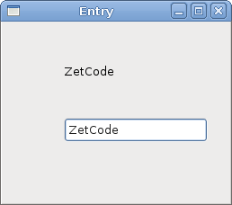
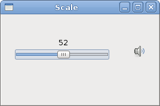
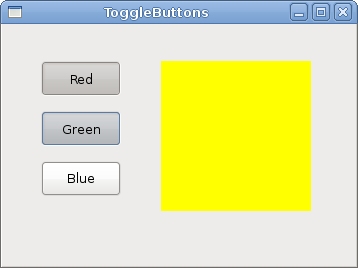
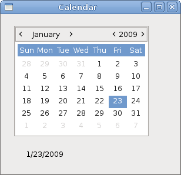

# Widgets II in GTK#

In this part of the GTK# programming tutorial, we continue introducing GTK# widgets.


We will cover the `Entry` widget, the `Scale` widget, `ToggleButton`, and `Calendar` widget.

## Entry

The `Entry` is a single line text entry field. This widget is used to enter textual data.

entry.cs

```csharp
using Gtk;
using System;
 
class SharpApp : Window {
 
    Label label;

    public SharpApp() : base("Entry")
    {
        SetDefaultSize(250, 200);
        SetPosition(WindowPosition.Center);
        BorderWidth = 7;
        DeleteEvent += delegate { Application.Quit(); };
        
        label = new Label("...");

        Entry entry = new Entry();
        entry.Changed += OnChanged;

        Fixed fix = new Fixed();
        fix.Put(entry, 60, 100);
        fix.Put(label, 60, 40);

        Add(fix);

        ShowAll();
    }

    void OnChanged(object sender, EventArgs args)
    {
        Entry entry = (Entry) sender;
        label.Text = entry.Text;
    }

    public static void Main()
    {
        Application.Init();
        new SharpApp();
        Application.Run();
    }
}
```

This example shows an entry widget and a label. The text that we key in the entry is displayed immediately in the label control.

```csharp
Entry entry = new Entry();
```

`Entry` widget is created.

```csharp
entry.Changed += OnChanged;
```

If the text in the `Entry` widget is changed, we call the `OnChanged()` method.

```csharp
void OnChanged(object sender, EventArgs args)
{
    Entry entry = (Entry) sender;
    label.Text = entry.Text;
}
```


We get the text from the `Entry` widget and set it to the label.

Figure: Entry Widget


## Scale

The `Scale` is a widget that lets the user graphically select a value by sliding a knob within a bounded interval. Our example will show a volume control.

hscale.cs

```csharp
using Gtk;
using System;
 
class SharpApp : Window {
 
    Gdk.Pixbuf mute, min, med, max;
    Image image;

    public SharpApp() : base("Scale")
    {
        SetDefaultSize(260, 150);
        SetPosition(WindowPosition.Center);
        DeleteEvent += delegate { Application.Quit(); };
        
        HScale scale = new HScale(0, 100, 1);
        scale.SetSizeRequest(160, 35);
        scale.ValueChanged += OnChanged;

        LoadPixbufs();

        image = new Image(mute);

        Fixed fix = new Fixed();
        fix.Put(scale, 20, 40);
        fix.Put(image, 219, 50);

        Add(fix);

        ShowAll();
    }

    void LoadPixbufs() 
    {
        try {
            mute = new Gdk.Pixbuf("mute.png");
            min = new Gdk.Pixbuf("min.png");
            med = new Gdk.Pixbuf("med.png");
            max = new Gdk.Pixbuf("max.png");
        } catch {
            Console.WriteLine("Error reading Pixbufs");
            Environment.Exit(1);
        }
    }

    void OnChanged(object obj, EventArgs args)
    {
        HScale scale = (HScale) obj;
        double val = scale.Value;

        if (val == 0) {
            image.Pixbuf = mute;
        } else if (val > 0 && val < 30) {
            image.Pixbuf = min;
        } else if (val > 30 && val < 80) {
            image.Pixbuf = med;
        } else {
            image.Pixbuf = max;
        }
    }

    public static void Main()
    {
        Application.Init();
        new SharpApp();
        Application.Run();
    }
}
```

In the example above, we have `HScale` and `Image` widgets. By dragging the scale we change the image on the `Image` widget.

```csharp
HScale scale = new HScale(0, 100, 1);
```

`HScale` widget is created. The parameters are lower boundary, upper boundary and step.

```csharp
HScale scale = (HScale) obj;
double val = scale.Value;
```


In the `OnChange()` method we obtain the value of the scale widget.

```csharp
if (val == 0) {
    image.Pixbuf = mute;
} else if (val > 0 && val <= 30) {
    image.Pixbuf = min;
} else if (val > 30 && val < 80) {
    image.Pixbuf = med;
} else {
image.Pixbuf = max;
}
```

Depending on the obtained value, we change the picture in the image widget.

Figure: HScale Widget


## ToggleButton

`ToggleButton` is a button that has two states: pressed and not pressed. You toggle between these two states by clicking on it. There are situations where this functionality fits well.

togglebuttons.cs

```csharp
using Gtk;
using System;
 
class SharpApp : Window {
 
    DrawingArea darea;
    Gdk.Color col;

    public SharpApp() : base("ToggleButtons")
    {
        col = new Gdk.Color(0, 0, 0);

        SetDefaultSize(350, 240);
        SetPosition(WindowPosition.Center);
        BorderWidth = 7;
        DeleteEvent += delegate { Application.Quit(); };
        
        ToggleButton red = new ToggleButton("Red");
        red.SetSizeRequest(80, 35);
        red.Clicked += OnRed;

        ToggleButton green = new ToggleButton("Green");
        green.SetSizeRequest(80, 35);
        green.Clicked += OnGreen;

        ToggleButton blue = new ToggleButton("Blue");
        blue.SetSizeRequest(80, 35);
        blue.Clicked += OnBlue;

        darea = new DrawingArea();
        darea.SetSizeRequest(150, 150);
        darea.ModifyBg(StateType.Normal, col);

        Fixed fix = new Fixed();
        fix.Put(red, 30, 30);
        fix.Put(green, 30, 80);
        fix.Put(blue, 30, 130);
        fix.Put(darea, 150, 30);

        Add(fix);

        ShowAll();
    }

    void OnRed(object sender, EventArgs args) 
    {
        ToggleButton tb = (ToggleButton) sender;
        
        if (tb.Active) {
            col.Red = 65535; 
        } else {
            col.Red = 0;
        }

        darea.ModifyBg(StateType.Normal, col);         
    }

    void OnGreen(object sender, EventArgs args) 
    {
        ToggleButton tb = (ToggleButton) sender;

        if (tb.Active) {
            col.Green = 65535; 
        } else {
            col.Green = 0;
        }
        
        darea.ModifyBg(StateType.Normal, col);
    }

    void OnBlue(object sender, EventArgs args) 
    {
        ToggleButton tb = (ToggleButton) sender;

        if (tb.Active) {
            col.Blue = 65535; 
        } else {
            col.Blue = 0;
        }

        darea.ModifyBg(StateType.Normal, col);
    }

    public static void Main()
    {
        Application.Init();
        new SharpApp();
        Application.Run();
    }
}
```

In our example, we show three toggle buttons and a `DrawingArea`. We set the background colour of the area to black. The toggle buttons will toggle the red, green and blue parts of the colour value. The background colour will depend on which toggle buttons we have pressed.

```csharp
col = new Gdk.Color(0, 0, 0);
```

This is the colour value that is going to be updated with the toggle buttons.

```csharp
ToggleButton red = new ToggleButton("Red");
red.SetSizeRequest(80, 35);
red.Clicked += OnRed;
```


The `ToggleButton` widget is created. We set its size to 80x35 pixels. Each of the toggle buttons has its own handler method.

```csharp
darea = new DrawingArea();
darea.SetSizeRequest(150, 150);
darea.ModifyBg(StateType.Normal, col);
```

The `DrawingArea` widget is the widget that displays the colour, mixed by the toggle buttons. At start, it shows black colour.

```csharp
if (tb.Active) {
    col.Red = 65535; 
} else {
    col.Red = 0;
}
```

We update the red part of the colour according to the value of the `Active` property.

```csharp
darea.ModifyBg(StateType.Normal, col);
```

We update the colour of the `DrawingArea` widget.

Figure: ToggleButton widget


## Calendar

Our final widget is the `Calendar` widget. It is used to work with dates.

calendar.cs

```csharp
using Gtk;
using System;
 
class SharpApp : Window {
 
    private Label label;

    public SharpApp() : base("Calendar")
    {
        SetDefaultSize(300, 270);
        SetPosition(WindowPosition.Center);
        DeleteEvent += delegate { Application.Quit(); };
        
        label = new Label("...");

        Calendar calendar = new Calendar();
        calendar.DaySelected += OnDaySelected;

        Fixed fix = new Fixed();
        fix.Put(calendar, 20, 20);
        fix.Put(label, 40, 230);

        Add(fix);

        ShowAll();
    }

    void OnDaySelected(object sender, EventArgs args)
    {
        Calendar cal = (Calendar) sender;
        label.Text = cal.Month + 1 + "/" + cal.Day + "/" + cal.Year;
    }

    public static void Main()
    {
        Application.Init();
        new SharpApp();
        Application.Run();
    }
}
```

We have the `Calendar` widget and a `Label`. The selected day from the calendar is shown in the label.

```csharp
Calendar calendar = new Calendar();
```

`Calendar` widget is created.

```csharp
Calendar cal = (Calendar) sender;
label.Text = cal.Month + 1 + "/" + cal.Day + "/" + cal.Year;
```

In the `OnDaySelected()` method we get the referece to the `Calendar` widget, and update the label to the currently selected date.

Figure: Calendar


In this chapter, we finished talking about the GTK# widgets.

[Previous](./widgets.md) [Next](./customwidget.md)

