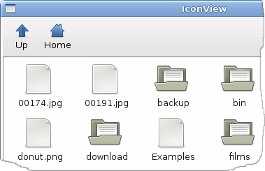
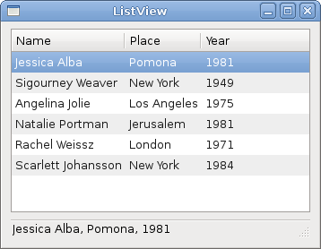
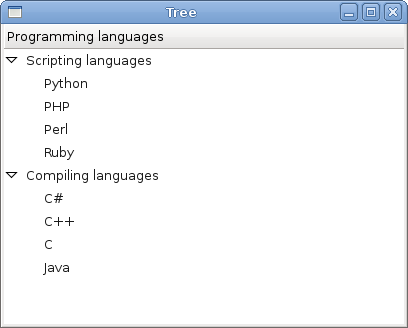

# GTK中的高级小部件

在GTK＃编程教程的这一部分中，我们将介绍GTK＃中的一些更高级的小部件。我们将介绍IconView，ListView和TreeView小部件。

## 图标视图

`IconView`是一个小部件，在网格中显示图标列表。

iconview.cs

```csharp
using System;
using System.IO;
using Gtk;


public class SharpApp : Window
{
    const int COL_PATH = 0;
    const int COL_DISPLAY_NAME = 1;
    const int COL_PIXBUF = 2;
    const int COL_IS_DIRECTORY = 3;

    DirectoryInfo root = new DirectoryInfo("/");
    Gdk.Pixbuf dirIcon, fileIcon;
    ListStore store;
    ToolButton upButton;

    public SharpApp() : base("IconView")
    {
        SetDefaultSize(650, 400);
        SetPosition(WindowPosition.Center);
        DeleteEvent += delegate { Application.Quit(); };

        VBox vbox = new VBox(false, 0);
        Add(vbox);

        Toolbar toolbar = new Toolbar();
        vbox.PackStart(toolbar, false, false, 0);

        upButton = new ToolButton(Stock.GoUp);
        upButton.IsImportant = true;
        upButton.Sensitive = false;
        toolbar.Insert(upButton, -1);

        ToolButton homeButton = new ToolButton(Stock.Home);
        homeButton.IsImportant = true;
        toolbar.Insert(homeButton, -1);

        fileIcon = GetIcon(Stock.File);
        dirIcon = GetIcon(Stock.Open);

        ScrolledWindow sw = new ScrolledWindow();
        sw.ShadowType = ShadowType.EtchedIn;
        sw.SetPolicy(PolicyType.Automatic, PolicyType.Automatic);
        vbox.PackStart(sw, true, true, 0);

        store = CreateStore();
        FillStore();

        IconView iconView = new IconView(store);
        iconView.SelectionMode = SelectionMode.Multiple;

        upButton.Clicked += new EventHandler(OnUpClicked);
        homeButton.Clicked += new EventHandler(OnHomeClicked);

        iconView.TextColumn = COL_DISPLAY_NAME;
        iconView.PixbufColumn = COL_PIXBUF;

        iconView.ItemActivated += OnItemActivated;
        sw.Add(iconView);
        iconView.GrabFocus();

        ShowAll();
    }

    Gdk.Pixbuf GetIcon(string name)
    {
        return Gtk.IconTheme.Default.LoadIcon(name, 48, (IconLookupFlags) 0);
    }

    ListStore CreateStore()
    {
        ListStore store = new ListStore(typeof (string), 
            typeof(string), typeo (Gdk.Pixbuf), typeof(bool));

        store.SetSortColumnId(COL_DISPLAY_NAME, SortType.Ascending);

        return store;
    }

    void FillStore()
    {
        store.Clear();

        if (!root.Exists)
            return;

        foreach (DirectoryInfo di in root.GetDirectories())
        {
            if (!di.Name.StartsWith("."))
                store.AppendValues(di.FullName, di.Name, dirIcon, true);
        }

        foreach (FileInfo file in root.GetFiles())
        {
            if (!file.Name.StartsWith("."))
                store.AppendValues(file.FullName, file.Name, fileIcon, false);
        }
    }

    void OnHomeClicked(object sender, EventArgs a)
    {
        root = new DirectoryInfo(Environment.GetFolderPath(
            Environment.SpecialFolder.Personal));
        FillStore();
        upButton.Sensitive = true;
    }

    void OnItemActivated(object sender, ItemActivatedArgs a)
    {
        TreeIter iter;
        store.GetIter(out iter, a.Path);
        string path = (string) store.GetValue(iter, COL_PATH);
        bool isDir = (bool) store.GetValue(iter, COL_IS_DIRECTORY);

        if (!isDir)
            return;

        root = new DirectoryInfo(path);
        FillStore();

        upButton.Sensitive = true;
    }

    void OnUpClicked(object sender, EventArgs a)
    {
        root = root.Parent;
        FillStore();
        upButton.Sensitive = (root.FullName == "/" ? false : true);
    }

    public static void Main()
    {   
        Application.Init();
        new SharpApp();
        Application.Run();
    }
}
```

本示例显示当前所选目录的图标。它有一个工具栏和两个按钮。向上按钮和主页按钮。我们使用它们来浏览文件系统。

```csharp
ListStore store;
```

该`ListStore`是一个圆柱状列表数据结构。我们用它来存储`IconView`小部件的数据。

```csharp
DirectoryInfo root = new DirectoryInfo("/");
```

这是根目录。我们从这里开始。根目录是我们在`IconView`小部件中显示的目录。

```csharp
ListStore store = new ListStore(typeof(string), 
    typeof(string), typeof(Gdk.Pixbuf), typeof(bool));
```

在`CreateStore()`方法中，我们创建`ListStore`对象。它有四个参数。路径，目录或文件的名称，图像以及确定它是目录还是文件的布尔值。

```csharp
foreach (DirectoryInfo di in root.GetDirectories())
{
    if (!di.Name.StartsWith("."))
        store.AppendValues(di.FullName, di.Name, dirIcon, true);
}
```

在该`FillStore()`方法中，我们用数据填充列表存储。在这里，我们找出当前路径中的所有目录。

```csharp
void OnHomeClicked(object sender, EventArgs a)
{
    root = new DirectoryInfo(Environment.GetFolderPath(Environment.SpecialFolder.Personal));
    FillStore();
    upButton.Sensitive = true;
}
```

如果单击主页按钮，则将获得对主目录的引用。重新填充列表存储。并激活向上按钮。

```csharp
void OnItemActivated(object sender, ItemActivatedArgs a)
{ 
...
}
```

在该`OnItemActivated()`方法中，当我们从图标视图小部件中单击一个图标时，我们会对生成的事件做出反应。

```csharp
string path = (string) store.GetValue(iter, COL_PATH);
bool isDir = (bool) store.GetValue(iter, COL_IS_DIRECTORY);

if (!isDir)
    return;
```

我们得到激活项目的路径。然后我们确定它是目录还是文件。如果是文件，我们返回。

```csharp
root = new DirectoryInfo(path);
FillStore();

upButton.Sensitive = true;
```

如果是目录，我们将根目录替换为当前路径，重新填充商店，然后使向上按钮敏感。

```csharp
void OnUpClicked(object sender, EventArgs a)
{
    root = root.Parent;
    FillStore();
    upButton.Sensitive = (root.FullName == "/" ? false : true);
}
```

如果单击向上按钮，则将根目录替换为其父目录。重新填充列表存储。如果我们位于文件系统的根（/）目录下，则向上按钮将被激活。

图：IconView

## 列表视图

在以下示例中，我们使用`TreeView`小部件显示列表视图。再次`ListStore`用于存储数据。

listview.cs

```csharp
using System;
using System.Collections;
using Gtk;

public class Actress
{
    public string Name;
    public string Place;
    public int Year;

    public Actress(string name, string place, int year)
    {
        Name = name;
        Place = place;
        Year = year;
    }
}

public class SharpApp : Window
{
    ListStore store;
    Statusbar statusbar;

    enum Column
    {
        Name,
        Place,
        Year
    }

    Actress[] actresses =
    {
        new Actress("Jessica Alba", "Pomona", 1981),
        new Actress("Sigourney Weaver", "New York", 1949),
        new Actress("Angelina Jolie", "Los Angeles", 1975),
        new Actress("Natalie Portman", "Jerusalem", 1981),
        new Actress("Rachel Weissz", "London", 1971),
        new Actress("Scarlett Johansson", "New York", 1984) 
    };

    public SharpApp() : base ("ListView")
    {
        BorderWidth = 8;

        SetDefaultSize(350, 250);
        SetPosition(WindowPosition.Center);
        DeleteEvent += delegate { Application.Quit(); };

        VBox vbox = new VBox(false, 8);


        ScrolledWindow sw = new ScrolledWindow();
        sw.ShadowType = ShadowType.EtchedIn;
        sw.SetPolicy(PolicyType.Automatic, PolicyType.Automatic);
        vbox.PackStart(sw, true, true, 0);

        store = CreateModel();

        TreeView treeView = new TreeView(store);
        treeView.RulesHint = true;
        treeView.RowActivated += OnRowActivated;
        sw.Add(treeView);

        AddColumns(treeView);

        statusbar = new Statusbar();

        vbox.PackStart(statusbar, false, false, 0);

        Add(vbox);
        ShowAll();
    }

    void OnRowActivated (object sender, RowActivatedArgs args) {

        TreeIter iter;        
        TreeView view = (TreeView) sender;   

        if (view.Model.GetIter(out iter, args.Path)) {
            string row = (string) view.Model.GetValue(iter, (int) Column.Name );
            row += ", " + (string) view.Model.GetValue(iter, (int) Column.Place );
            row += ", " + view.Model.GetValue(iter, (int) Column.Year );
            statusbar.Push(0, row);
        }
    }

    void AddColumns(TreeView treeView)
    {
        CellRendererText rendererText = new CellRendererText();
        TreeViewColumn column = new TreeViewColumn("Name", rendererText,
            "text", Column.Name);
        column.SortColumnId = (int) Column.Name;
        treeView.AppendColumn(column);

        rendererText = new CellRendererText();
        column = new TreeViewColumn("Place", rendererText, 
            "text", Column.Place);
        column.SortColumnId = (int) Column.Place;
        treeView.AppendColumn(column);

        rendererText = new CellRendererText();
        column = new TreeViewColumn("Year", rendererText, 
            "text", Column.Year);
        column.SortColumnId = (int) Column.Year;
        treeView.AppendColumn(column);
    }


    ListStore CreateModel()
    {
        ListStore store = new ListStore( typeof(string),
            typeof(string), typeof(int) );

        foreach (Actress act in actresses) {
            store.AppendValues(act.Name, act.Place, act.Year );
        }

        return store;
    }

    public static void Main()
    {
        Application.Init();
        new SharpApp();
        Application.Run();
    }
} 
```

在我们的示例中，我们在`TreeView`小部件中显示了六个女演员的列表。每行分别显示名称，出生地和出生年份。

```csharp
public class Actress
{
    public string Name;
    public string Place;
    public int Year;
...
}
```

的`Actress`类用于存储关于一个演员的数据。

```csharp
ListStore CreateModel()
{
    ListStore store = new ListStore( typeof(string), 
        typeof(string), typeof(int) );

    foreach (Actress act in actresses) {
        store.AppendValues(act.Name, act.Place, act.Year );
    }

    return store;
}
```

在该`CreateModel()`方法中，我们创建列表存储。列表存储具有三个参数。女演员的名字，出生地和出生年份。这是我们`TreeView`小部件的数据模型。

```csharp
TreeView treeView = new TreeView(store);
treeView.RulesHint = true;
treeView.RowActivated += OnRowActivated;
```

在这里，我们`TreeView`以列表存储为参数创建小部件。

```csharp
CellRendererText rendererText = new CellRendererText();
TreeViewColumn column = new TreeViewColumn("Name", rendererText, "text", Column.Name);
column.SortColumnId = (int) Column.Name;
treeView.AppendColumn(column);
```

在该`AddColumns()`方法中，我们向`TreeView`小部件添加三列。上面的代码创建了一个显示女演员姓名的列。

```csharp
if (view.Model.GetIter(out iter, args.Path)) {
    string row = (string) view.Model.GetValue(iter, (int) Column.Name );
    row += ", " + (string) view.Model.GetValue(iter, (int) Column.Place );
    row += ", " + view.Model.GetValue(iter, (int) Column.Year );
    statusbar.Push(0, row);
}
```

如果双击某个项目，则会在状态栏中显示整行。

图：ListView

## 树状视图

在本章的最后一个示例中，我们使用`TreeView`小部件显示数据的分层树。

tree.cs

```csharp
using Gtk;


public class SharpApp : Window
{

    public SharpApp() : base ("Tree")
    {
        SetDefaultSize(400, 300);
        SetPosition(WindowPosition.Center);
        DeleteEvent += delegate { Application.Quit(); };

        TreeView tree = new TreeView();

        TreeViewColumn languages = new TreeViewColumn();
        languages.Title = "Programming languages";

        CellRendererText cell = new CellRendererText();
        languages.PackStart(cell, true);
        languages.AddAttribute(cell, "text", 0);

        TreeStore treestore = new TreeStore(typeof(string), typeof(string));

        TreeIter iter = treestore.AppendValues("Scripting languages");
        treestore.AppendValues(iter, "Python");
        treestore.AppendValues(iter, "PHP");
        treestore.AppendValues(iter, "Perl");
        treestore.AppendValues(iter, "Ruby");

        iter = treestore.AppendValues("Compiling languages");
        treestore.AppendValues(iter, "C#");
        treestore.AppendValues(iter, "C++");
        treestore.AppendValues(iter, "C");
        treestore.AppendValues(iter, "Java");

        tree.AppendColumn(languages);
        tree.Model = treestore;

        Add(tree);
        ShowAll();
    }

    public static void Main()
    {
        Gtk.Application.Init();
        new SharpApp();
        Gtk.Application.Run();
    }
}
```

这次，我们使用`TreeView`小部件显示分层数据。

```csharp
TreeView tree = new TreeView();
```

`TreeView` 小部件已创建。

```csharp
TreeViewColumn languages = new TreeViewColumn();
languages.Title = "Programming languages";
```

它有一列名为“编程语言”。

```csharp
CellRendererText cell = new CellRendererText();
languages.PackStart(cell, true);
languages.AddAttribute(cell, "text", 0);
```

我们在`TreeView`小部件中显示文本数据。

```csharp
TreeStore treestore = new TreeStore(typeof(string), typeof(string));
```

为了存储数据，我们使用`TreeStore`对象。

```csharp
TreeIter iter = treestore.AppendValues("Scripting languages");
treestore.AppendValues(iter, "Python");
treestore.AppendValues(iter, "PHP");
```

我们将数据附加到树上。该`TreeIter`是连续访问数据。

```csharp
tree.AppendColumn(languages);
```

一列被追加到树上。

```csharp
tree.Model = treestore;
```

最后，我们为树小部件设置数据模型。

图：树

在本章中，我们讨论的是高级GTK＃小部件。

[上一个](./widgetsII.md) [下一个](./dialogs.md)