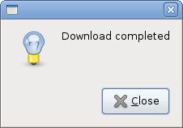
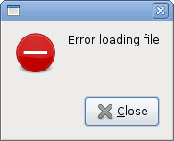
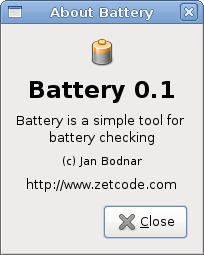
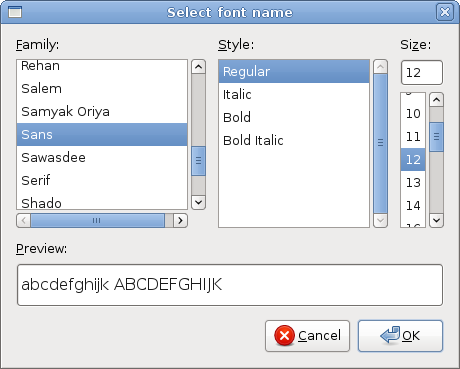
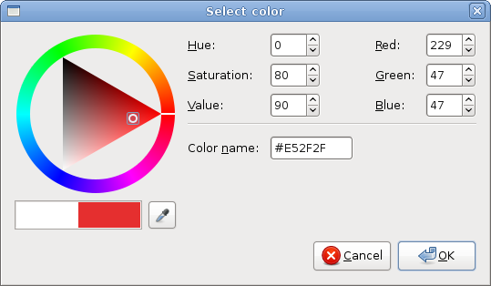

# GTK中的对话框

在GTK＃编程教程的这一部分中，我们将介绍对话框。

对话框窗口或对话框是大多数现代GUI应用程序必不可少的部分。对话被定义为两个或更多人之间的对话。在计算机应用程序中，对话框是一个窗口，用于与应用程序“对话”。对话框用于输入数据，修改数据，更改应用程序设置等。对话框是用户与计算机程序之间进行通信的重要手段。

## 消息对话框

消息对话框是方便的对话框，可向应用程序的用户提供消息。该消息包含文本和图像数据。

messages.cs

```csharp
using Gtk;
using System;

class SharpApp : Window {


    public SharpApp() : base("Messages")
    {
        SetDefaultSize(250, 100);
        SetPosition(WindowPosition.Center);
        DeleteEvent += delegate { Application.Quit(); }; 


        Table table = new Table(2, 2, true);

        Button info = new Button("Information");
        Button warn = new Button("Warning");
        Button ques = new Button("Question");
        Button erro = new Button("Error");

        info.Clicked += delegate {
            MessageDialog md = new MessageDialog(this, 
                DialogFlags.DestroyWithParent, MessageType.Info, 
                ButtonsType.Close, "Download completed");
            md.Run();
            md.Destroy();
        };

        warn.Clicked += delegate {
            MessageDialog md = new MessageDialog(this, 
                DialogFlags.DestroyWithParent, MessageType.Warning, 
                ButtonsType.Close, "Unallowed operation");
            md.Run();
            md.Destroy();
        };


        ques.Clicked += delegate {
            MessageDialog md = new MessageDialog(this, 
                DialogFlags.DestroyWithParent, MessageType.Question, 
                ButtonsType.Close, "Are you sure to quit?");
            md.Run();
            md.Destroy();
        };

        erro.Clicked += delegate {
            MessageDialog md = new MessageDialog (this, 
                DialogFlags.DestroyWithParent, MessageType.Error, 
                ButtonsType.Close, "Error loading file");
            md.Run();
            md.Destroy();
        };

        table.Attach(info, 0, 1, 0, 1);
        table.Attach(warn, 1, 2, 0, 1);
        table.Attach(ques, 0, 1, 1, 2);
        table.Attach(erro, 1, 2, 1, 2);

        Add(table);

        ShowAll();
    }

    public static void Main()
    {
        Application.Init();
        new SharpApp();
        Application.Run();
    }
}
```

在我们的示例中，我们将显示四种消息对话框。信息，警告，问题和错误消息对话框。

```csharp
Button info = new Button("Information");
Button warn = new Button("Warning");
Button ques = new Button("Question");
Button erro = new Button("Error");
```

我们有四个按钮。这些按钮中的每个按钮都会显示不同类型的消息对话框。

```csharp
info.Clicked += delegate {
    MessageDialog md = new MessageDialog(this, 
        DialogFlags.DestroyWithParent, MessageType.Info, 
        ButtonsType.Close, "Download completed");
    md.Run();
    md.Destroy();
};
```

如果单击信息按钮，将显示“信息”对话框。该`MessageType.Info`指定对话框的类型。在`ButtonsType.Close`指定按钮被显示在对话框中。最后一个参数是显示的消息。对话框随`Run()`方法一起显示。程序员还必须调用`Destroy()`或`Hide()`方法。

   

## 关于对话框

该`AboutDialog`有关应用程序的显示信息。`AboutDialog`可以显示徽标，应用程序名称，版本，版权，网站或许可证信息。也有可能对作者，文档撰写者，翻译者和艺术家予以赞扬。

关于dialog.cs

```csharp
using Gtk;
using System;

class SharpApp : Window {


    public SharpApp() : base("About")
    {
        SetDefaultSize(300, 270);
        SetPosition(WindowPosition.Center);
        DeleteEvent += delegate { Application.Quit(); } ;

        Button button = new Button("About");
        button.Clicked += OnClicked;

        Fixed fix = new Fixed();
        fix.Put(button, 20, 20);
        Add(fix);

        ShowAll();
    }


    void OnClicked(object sender, EventArgs args)
    {
        AboutDialog about = new AboutDialog();
        about.ProgramName = "Battery";
        about.Version = "0.1";
        about.Copyright = "(c) Jan Bodnar";
        about.Comments = @"Battery is a simple tool for 
battery checking";
        about.Website = "http://www.zetcode.com";
        about.Logo = new Gdk.Pixbuf("battery.png");
        about.Run();
        about.Destroy();
    }


    public static void Main()
    {
        Application.Init();
        new SharpApp();
        Application.Run();
    }
}
```

该代码示例结合使用的`AboutDialog`某些功能。

```csharp
AboutDialog about = new AboutDialog();
```

我们创建一个`AboutDialog`。

```csharp
about.ProgramName = "Battery";
about.Version = "0.1";
about.Copyright = "(c) Jan Bodnar";
```

通过设置对话框的属性，我们指定名称，版本和版权。

```
about.Logo = new Gdk.Pixbuf("battery.png");
```

此行创建徽标。

图：AboutDialog

## 字体选择对话框

这`FontSelectionDialog`是用于选择字体的对话框。它通常用于进行一些文本编辑或格式化的应用程序中。

fontdialog.cs

```csharp
using Gtk;
using System;

class SharpApp : Window {

    Label label;

    public SharpApp() : base("Font Selection Dialog")
    {
        SetDefaultSize(300, 220);
        SetPosition(WindowPosition.Center);
        DeleteEvent += delegate { Application.Quit(); } ;

        label = new Label("The only victory over love is flight.");
        Button button = new Button("Select font");
        button.Clicked += OnClicked;

        Fixed fix = new Fixed();
        fix.Put(button, 100, 30);
        fix.Put(label, 30, 90);
        Add(fix);

        ShowAll();
    }


    void OnClicked(object sender, EventArgs args)
    {
        FontSelectionDialog fdia = new FontSelectionDialog("Select font name");
        fdia.Response += delegate (object o, ResponseArgs resp) {

            if (resp.ResponseId == ResponseType.Ok) {
               Pango.FontDescription fontdesc = 
                   Pango.FontDescription.FromString(fdia.FontName);
               label.ModifyFont(fontdesc);
            }
        };

        fdia.Run();
        fdia.Destroy();
    }

    public static void Main()
    {
        Application.Init();
        new SharpApp();
        Application.Run();
    }
}
```

在代码示例中，我们有一个按钮和一个标签。我们`FontSelectionDialog`通过单击按钮来显示。

```csharp
FontSelectionDialog fdia = new FontSelectionDialog("Select font name");
```

我们创建 `FontSelectionDialog.`

```csharp
fdia.Response += delegate (object o, ResponseArgs resp) {

    if (resp.ResponseId == ResponseType.Ok) {
        Pango.FontDescription fontdesc = Pango.FontDescription.FromString(fdia.FontName);
        label.ModifyFont(fontdesc);
    }
};
```

如果单击“确定”按钮，则标签小部件的字体将更改为我们在对话框中选择的字体。

图：FontSelectionDialog

## 颜色选择对话框

`ColorSelectionDialog` 是用于选择颜色的对话框。

colordialog.cs

```csharp
using Gtk;
using System;

class SharpApp : Window {

    Label label;

    public SharpApp() : base("Color Dialog")
    {
        SetDefaultSize(300, 220);
        SetPosition(WindowPosition.Center);
        DeleteEvent += delegate { Application.Quit(); } ;

        label = new Label("The only victory over love is flight.");
        Button button = new Button("Select color");
        button.Clicked += OnClicked;

        Fixed fix = new Fixed();
        fix.Put(button, 100, 30);
        fix.Put(label, 30, 90);
        Add(fix);

        ShowAll();
    }


    void OnClicked(object sender, EventArgs args)
    {
        ColorSelectionDialog cdia = new ColorSelectionDialog("Select color");
        cdia.Response += delegate (object o, ResponseArgs resp) {

            if (resp.ResponseId == ResponseType.Ok) {
               label.ModifyFg(StateType.Normal, cdia.ColorSelection.CurrentColor);
            }
        };

        cdia.Run();
        cdia.Destroy();
    }


    public static void Main()
    {
        Application.Init();
        new SharpApp();
        Application.Run();
    }
}
```

该示例与上一个示例非常相似。这次我们更改标签的颜色。

```csharp
ColorSelectionDialog cdia = new ColorSelectionDialog("Select color");
```

我们创建`ColorSelectionDialog`。

```csharp
cdia.Response += delegate (object o, ResponseArgs resp) {

    if (resp.ResponseId == ResponseType.Ok) {
    label.ModifyFg(StateType.Normal, cdia.ColorSelection.CurrentColor);
    }
};
```

如果用户按下OK，我们将获得颜色并修改标签的颜色。

图：ColorSelectionDialog

在GTK＃教程的这一部分中，我们讨论了对话框。

[上一个](./advancedwidgets.md) [下一个](./pango.md)