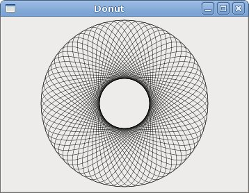
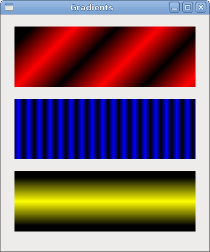
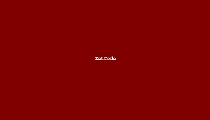
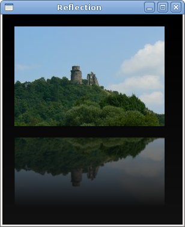

# GTK＃中使用Cairo绘图 II

在GTK＃编程教程的这一部分中，我们将继续使用Cairo库进行绘制。

## 甜甜圈

在下面的示例中，我们通过旋转一堆椭圆来创建复杂的形状。

donut.cs

```csharp
using Gtk;
using Cairo;
using System;

class SharpApp : Window {


    public SharpApp() : base("Donut")
    {
        SetDefaultSize(350, 250);
        SetPosition(WindowPosition.Center);
        DeleteEvent += delegate { Application.Quit(); };

        DrawingArea darea = new DrawingArea();
        darea.ExposeEvent += OnExpose;

        Add(darea);

        ShowAll();
    }

    void OnExpose(object sender, ExposeEventArgs args)
    {
        DrawingArea area = (DrawingArea) sender;
        Cairo.Context cr =  Gdk.CairoHelper.Create(area.GdkWindow);

        cr.LineWidth = 0.5;

        int width, height;
        width = Allocation.Width;
        height = Allocation.Height;

        cr.Translate(width/2, height/2);
        cr.Arc(0, 0, 120, 0, 2*Math.PI);
        cr.Stroke();

        cr.Save();

        for (int i = 0; i < 36; i++) {
            cr.Rotate( i*Math.PI/36);
            cr.Scale(0.3, 1);
            cr.Arc(0, 0, 120, 0, 2*Math.PI);
            cr.Restore();
            cr.Stroke();
            cr.Save();
        }

        ((IDisposable) cr.Target).Dispose();                                      
        ((IDisposable) cr).Dispose();
    }


    public static void Main()
    {
        Application.Init();
        new SharpApp();
        Application.Run();
    }
}
```

在此示例中，我们创建一个甜甜圈。形状类似于Cookie，因此称为甜甜圈。

```csharp
cr.Translate(width/2, height/2);
cr.Arc(0, 0, 120, 0, 2*Math.PI);
cr.Stroke();
```

刚开始时有一个椭圆。

```csharp
for (int i = 0; i < 36; i++) {
    cr.Rotate( i*Math.PI/36);
    cr.Scale(0.3, 1);
    cr.Arc(0, 0, 120, 0, 2*Math.PI);
    cr.Restore();
    cr.Stroke();
    cr.Save();
}
```

旋转几圈后，有一个甜甜圈。

图：甜甜圈

## 渐变色

在计算机图形学中，渐变是从浅到深或从一种颜色到另一种颜色的阴影的平滑混合。在2D绘图程序和绘画程序中，渐变用于创建彩色背景和特殊效果以及模拟灯光和阴影。（answers.com）

gradients.cs

```csharp
using Gtk;
using Cairo;
using System;

class SharpApp : Window {


    public SharpApp() : base("Gradients")
    {
        SetDefaultSize(340, 390);
        SetPosition(WindowPosition.Center);
        DeleteEvent += delegate { Application.Quit(); };

        DrawingArea darea = new DrawingArea();
        darea.ExposeEvent += OnExpose;

        Add(darea);

        ShowAll();
    }

    void OnExpose(object sender, ExposeEventArgs args)
    {
        DrawingArea area = (DrawingArea) sender;
        Cairo.Context cr =  Gdk.CairoHelper.Create(area.GdkWindow);


        LinearGradient lg1 = new LinearGradient(0.0, 0.0, 350.0, 350.0);

        int count = 1;

        for (double j=0.1; j<1.0; j+= 0.1) {
            if (Convert.ToBoolean(count % 2)) {
                lg1.AddColorStop(j, new Color(0, 0, 0, 1));
            } else {
                lg1.AddColorStop(j, new Color(1, 0, 0, 1));
            }
        count++;
        }

        cr.Rectangle(20, 20, 300, 100);
        cr.Pattern = lg1;
        cr.Fill();

        LinearGradient lg2 = new LinearGradient(0.0, 0.0, 350.0, 0);

        count = 1;

        for (double i=0.05; i<0.95; i+= 0.025) {
            if (Convert.ToBoolean(count % 2)) {
                lg2.AddColorStop(i, new Color(0, 0, 0, 1));
            } else {
                lg2.AddColorStop(i, new Color(0, 0, 1, 1));
            }
        count++;
        }

        cr.Rectangle(20, 140, 300, 100);
        cr.Pattern = lg2;
        cr.Fill();

        LinearGradient lg3 = new LinearGradient(20.0, 260.0,  20.0, 360.0);
        lg3.AddColorStop(0.1, new Color (0, 0, 0, 1) );
        lg3.AddColorStop(0.5, new Color (1, 1, 0, 1) );
        lg3.AddColorStop(0.9, new Color (0, 0, 0, 1) );

        cr.Rectangle(20, 260, 300, 100);
        cr.Pattern = lg3;
        cr.Fill();


        lg1.Destroy();
        lg2.Destroy();
        lg3.Destroy();        

        ((IDisposable) cr.Target).Dispose ();                                      
        ((IDisposable) cr).Dispose ();
    }

    public static void Main()
    {
        Application.Init();
        new SharpApp();
        Application.Run();
    }
}
```

在我们的示例中，我们绘制了三个具有三个不同渐变的矩形。

```csharp
LinearGradient lg1 = new LinearGradient(0.0, 0.0, 350.0, 350.0);
```

在这里，我们创建一个线性渐变图案。参数指定直线，沿着该直线绘制渐变。在我们的情况下，这是一条垂直线。

```csharp
LinearGradient lg3 = new LinearGradient(20.0, 260.0,  20.0, 360.0);
lg3.AddColorStop(0.1, new Color (0, 0, 0, 1) );
lg3.AddColorStop(0.5, new Color (1, 1, 0, 1) );
lg3.AddColorStop(0.9, new Color (0, 0, 0, 1) );
```

我们定义色标以产生渐变图案。在这种情况下，渐变是黑色和黄色的混合。通过添加两个黑色和一个黄色色标，我们创建了一个水平渐变图案。这些停止实际上是什么意思？在我们的情况下，我们从黑色开始，该颜色将以尺寸的1/10停止。然后，我们开始逐渐涂成黄色，最终达到形状的中心。黄色停在大小的9/10，我们再次开始用黑色绘画，直到结束。

图：渐变

## 泡芙

在以下示例中，我们创建一个粉扑效果。该示例将显示一个不断增长的居中文本，该文本将从某个点逐渐淡出。这是一个非常常见的效果，您经常可以在Flash动画中看到它。

puff.cs

```csharp
using Gtk;
using Cairo;
using System;

class SharpApp : Window {


    private bool timer = true;
    private double alpha = 1.0;
    private double size = 1.0;
    private DrawingArea darea;


    public SharpApp() : base("Puff")
    {
        SetDefaultSize(350, 200);
        SetPosition(WindowPosition.Center);
        DeleteEvent += delegate { Application.Quit(); };

        GLib.Timeout.Add(14, new GLib.TimeoutHandler(OnTimer));

        darea = new DrawingArea();
        darea.ExposeEvent += OnExpose;

        Add(darea);

        ShowAll();
    }

    bool OnTimer() 
    { 
        if (!timer) return false;

        darea.QueueDraw();
        return true;
    }      

    void OnExpose(object sender, ExposeEventArgs args)
    {
        DrawingArea area = (DrawingArea) sender;
        Cairo.Context cr =  Gdk.CairoHelper.Create(area.GdkWindow);

        int x = Allocation.Width / 2;
        int y = Allocation.Height / 2;

        cr.SetSourceRGB(0.5, 0, 0);
        cr.Paint();

        cr.SelectFontFace("Courier", FontSlant.Normal, FontWeight.Bold);

        size += 0.8;

        if (size > 20) {
            alpha -= 0.01;
        }

        cr.SetFontSize(size);
        cr.SetSourceRGB(1, 1, 1); 

        TextExtents extents = cr.TextExtents("ZetCode");

        cr.MoveTo(x - extents.Width/2, y);
        cr.TextPath("ZetCode");
        cr.Clip();
        cr.Stroke();
        cr.PaintWithAlpha(alpha);

        if (alpha <= 0) {
            timer = false;
        }

        ((IDisposable) cr.Target).Dispose();                                      
        ((IDisposable) cr).Dispose();
    }


    public static void Main()
    {
        Application.Init();
        new SharpApp();
        Application.Run();
    }
}
```

该示例在窗口上创建一个逐渐增长和褪色的文本。

```csharp
GLib.Timeout.Add(14, new GLib.TimeoutHandler(OnTimer));
```

每14毫秒`OnTimer()`调用一次该方法。

```csharp
bool OnTimer() 
{ 
    if (!timer) return false;

    darea.QueueDraw();
    return true;
}      
```

在`OnTimer()`方法中，我们`QueueDraw()`在绘图区域上调用方法，从而触发`ExposeEvent`。

```csharp
int x = Allocation.Width / 2;
int y = Allocation.Height / 2;
```

中间点的坐标。

```csharp
cr.SetSourceRGB(0.5, 0, 0);
cr.Paint();
```

我们将背景色设置为深红色。

```csharp
size += 0.8;
```

每个周期，字体大小将增加0.8个单位。

```csharp
if (size > 20) {
    alpha -= 0.01;
}
```

字体大小大于20后开始淡出。

```csharp
TextExtents extents = cr.TextExtents("ZetCode");
```

我们得到了文本指标。

```csharp
cr.MoveTo(x - extents.Width/2, y);
```

我们使用文本指标将文本放在窗口的中心。

```csharp
cr.TextPath("ZetCode");
cr.Clip();
```

我们获取文本的路径，并为其设置当前的片段区域。

```csharp
cr.Stroke();
cr.PaintWithAlpha(alpha);
```

我们绘制当前路径并考虑alpha值。

图：粉扑

## 反射

在下一个示例中，我们显示反射图像。这种美丽的效果使人产生幻觉，好像图像在水中被反射一样。

Reflection.cs

```csharp
using Gtk;
using Cairo;
using System;

class SharpApp : Window {

    private ImageSurface surface;
    private int imageWidth;
    private int imageHeight;
    private int gap;
    private int border;

    public SharpApp() : base("Reflection")
    {

        try {
            surface = new ImageSurface("slanec.png");
        } catch {
            Console.WriteLine("File not found");
            Environment.Exit(1);
        } 

        imageWidth = surface.Width;
        imageHeight = surface.Height;
        gap = 40;
        border = 20;

        SetDefaultSize(300, 350);
        SetPosition(WindowPosition.Center);
        DeleteEvent += delegate { Application.Quit(); };

        DrawingArea darea = new DrawingArea();
        darea.ExposeEvent += OnExpose;

        Add(darea);

        ShowAll();
    }

    void OnExpose(object sender, ExposeEventArgs args)
    {
        DrawingArea area = (DrawingArea) sender;
        Cairo.Context cr =  Gdk.CairoHelper.Create(area.GdkWindow);

        int width = Allocation.Width;
        int height = Allocation.Height;

        LinearGradient lg = new LinearGradient(width/2, 0, width/2, height*3);
        lg.AddColorStop(0, new Color(0, 0, 0, 1));
        lg.AddColorStop(height, new Color(0.2, 0.2, 0.2, 1));

        cr.Pattern = lg;
        cr.Paint();

        cr.SetSourceSurface(surface, border, border);
        cr.Paint();

        double alpha = 0.7;
        double step = 1.0 / imageHeight;

        cr.Translate(0, 2 * imageHeight + gap);
        cr.Scale(1, -1);

        int i = 0;


        while(i < imageHeight) {
            cr.Rectangle(new Rectangle(border, imageHeight-i, imageWidth, 1));

            i++;

            cr.Clip();
            cr.SetSource(surface, border, border);

            cr.PaintWithAlpha(alpha-=step);
            cr.ResetClip();
        }


        ((IDisposable) cr.Target).Dispose();                                      
        ((IDisposable) cr).Dispose();
    }

    public static void Main()
    {
        Application.Init();
        new SharpApp();
        Application.Run();
    }
}
```

该示例显示了一个反射的城堡。

```csharp
LinearGradient lg = new LinearGradient(width/2, 0, width/2, height*3);
lg.AddColorStop(0, new Color(0, 0, 0, 1));
lg.AddColorStop(height, new Color(0.2, 0.2, 0.2, 1));

cr.Pattern = lg;
cr.Paint();
```

背景充满了渐变色的油漆。涂料是从黑色到深灰色的平滑混合。

```csharp
cr.Translate(0, 2 * imageHeight + gap);
cr.Scale(1, -1);
```

此代码翻转图像并将其转换为原始图像下方。平移操作是必需的，因为缩放操作会使图像上下颠倒并向上平移图像。要了解发生了什么，只需拍摄一张照片并将其放在桌子上即可。现在翻转它。

```csharp
cr.Rectangle(new Rectangle(border, imageHeight-i, imageWidth, 1));

i++;

cr.Clip();
cr.SetSource(surface, border, border);

cr.PaintWithAlpha(alpha-=step);
cr.ResetClip();
```

代码的关键部分。我们使第二个图像透明。但是透明度不是恒定的。图像逐渐淡出。这是通过实现的`GradientPaint`。

图：反射

## 等候

在此示例中，我们使用透明效果创建一个等待演示。我们将绘制8条线，这些线将逐渐消失，从而产生一条线在移动的错觉。这种效果通常用于通知用户，一项艰巨的任务正在幕后进行。一个示例是通过互联网流式传输视频。

等待中

```csharp
using Gtk;
using Cairo;
using System;

class SharpApp : Window {


    private double [,] trs = new double[,] {
        { 0.0, 0.15, 0.30, 0.5, 0.65, 0.80, 0.9, 1.0 },
        { 1.0, 0.0,  0.15, 0.30, 0.5, 0.65, 0.8, 0.9 },
        { 0.9, 1.0,  0.0,  0.15, 0.3, 0.5, 0.65, 0.8 },
        { 0.8, 0.9,  1.0,  0.0,  0.15, 0.3, 0.5, 0.65},
        { 0.65, 0.8, 0.9,  1.0,  0.0,  0.15, 0.3, 0.5 },
        { 0.5, 0.65, 0.8, 0.9, 1.0,  0.0,  0.15, 0.3 },
        { 0.3, 0.5, 0.65, 0.8, 0.9, 1.0,  0.0,  0.15 },
        { 0.15, 0.3, 0.5, 0.65, 0.8, 0.9, 1.0,  0.0, }
    };

    private short count = 0;
    private DrawingArea darea;

    public SharpApp() : base("Waiting")
    {
        SetDefaultSize(250, 150);
        SetPosition(WindowPosition.Center);
        DeleteEvent += delegate { Application.Quit(); };

        GLib.Timeout.Add(100, new GLib.TimeoutHandler(OnTimer));

        darea = new DrawingArea();
        darea.ExposeEvent += OnExpose;

        Add(darea);

        ShowAll();
    }

    bool OnTimer() 
    { 
        count += 1;
        darea.QueueDraw();
        return true;
    }        


    void OnExpose(object sender, ExposeEventArgs args)
    {
        DrawingArea area = (DrawingArea) sender;
        Cairo.Context cr =  Gdk.CairoHelper.Create(area.GdkWindow);

        cr.LineWidth = 3;
        cr.LineCap = LineCap.Round;

        int width, height;
        width = Allocation.Width;
        height = Allocation.Height;

        cr.Translate(width/2, height/2);

        for (int i = 0; i < 8; i++) {
            cr.SetSourceRGBA(0, 0, 0, trs[count%8, i]);
            cr.MoveTo(0.0, -10.0);
            cr.LineTo(0.0, -40.0);
            cr.Rotate(Math.PI/4);
            cr.Stroke();
        }

        ((IDisposable) cr.Target).Dispose();                                      
        ((IDisposable) cr).Dispose();
    }

    public static void Main()
    {
        Application.Init();
        new SharpApp();
        Application.Run();
    }
}
```

我们用八个不同的alpha值绘制八条线。

```csharp
GLib.Timeout.Add(100, new GLib.TimeoutHandler(OnTimer));
```

我们使用计时器功能来创建动画。

```csharp
private double [,] trs = new double[,] {
    { 0.0, 0.15, 0.30, 0.5, 0.65, 0.80, 0.9, 1.0 },
    ...
};
```

这是此演示中使用的透明度值的二维数组。有8行，每行一种状态。8行中的每行将连续使用这些值。

```csharp
cr.LineWidth = 3;
cr.LineCap = LineCap.Round;
```

我们使线条更粗一些，以便更好地显示它们。我们用带帽的线画线。

```csharp
cr.SetSourceRGBA(0, 0, 0, trs[count%8, i]);
```

在这里，我们定义了一条线的透明度值。

```csharp
cr.MoveTo(0.0, -10.0);
cr.LineTo(0.0, -40.0);
cr.Rotate(Math.PI/4);
cr.Stroke();
```

这些代码行将绘制八行中的每行。

图：等待中

在GTK＃编程库的这一章中，我们使用Cairo库进行了一些更高级的绘制。

[上一个](./drawing.md) [下一个](./customwidget.md)