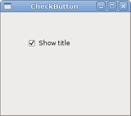

# GTK中的小部件

在GTK＃编程教程的这一部分中，我们将介绍一些GTK＃小部件。

小部件是GUI应用程序的基本构建块。多年来，几个小部件已成为所有OS平台上所有工具包中的标准。例如，按钮，复选框或滚动条。GTK＃工具箱的理念是将小部件的数量保持在最低水平。将创建更多专门的小部件作为自定义GTK＃小部件。

## 标签

该`Label`控件显示文本。

label.cs

```csharp
using Gtk;

class SharpApp : Window {

   string text = @"Meet you downstairs in the bar and heard
your rolled up sleeves and your skull t-shirt
You say why did you do it with him today?
and sniff me out like I was Tanqueray

cause you're my fella, my guy
hand me your stella and fly
by the time I'm out the door
you tear men down like Roger Moore

I cheated myself
like I knew I would
I told ya, I was trouble
you know that I'm no good";


    public SharpApp() : base("You know I'm No Good")
    {
        BorderWidth = 8;
        SetPosition(WindowPosition.Center);

        DeleteEvent += delegate { Application.Quit(); };

        Label lyrics = new Label(text);
        Add(lyrics);

        ShowAll();
    }

    public static void Main()
    {
        Application.Init();
        new SharpApp();
        Application.Run();
    }
}
```

该代码示例在窗口上显示了一些歌词。

```csharp
    string text = @"Meet you downstairs in the bar and heard
your rolled up sleeves and your skull t-shirt
...
```

在C＃编程语言中，多行字符串以`@`字符开头。

```csharp
BorderWidth = 8;
```

在`Label`被一些空的空间包围。

```csharp
Label lyrics = new Label(text);
Add(lyrics);
```

该`Label`控件被创建并添加到窗口。

图：标签小部件

## 检查按钮

`CheckButton`是具有两种状态的窗口小部件：开启和关闭。开状态通过复选标记显示。它用来表示一些布尔属性。

checkbutton.cs

```csharp
using Gtk;
using System;

class SharpApp : Window {


    public SharpApp() : base("CheckButton")
    {
        SetDefaultSize(250, 200);
        SetPosition(WindowPosition.Center);

        DeleteEvent += delegate { Application.Quit(); };

        CheckButton cb = new CheckButton("Show title");
        cb.Active = true;
        cb.Toggled += OnToggle;

        Fixed fix = new Fixed();
        fix.Put(cb, 50, 50);

        Add(fix);
        ShowAll();
    }


    void OnToggle(object sender, EventArgs args) 
    {
        CheckButton cb = (CheckButton) sender;

        if (cb.Active) {
            Title = "CheckButton";
        } else {
            Title = " ";
        }
    }

    public static void Main()
    {
        Application.Init();
        new SharpApp();
        Application.Run();
    }
}
```

根据的状态，我们将在窗口的标题栏中显示标题`CheckButton`。

```csharp
CheckButton cb = new CheckButton("Show title");
```

`CheckButton` 小部件已创建。

```csharp
cb.Active = true;
```

默认情况下标题是可见的，因此我们默认情况下选中复选按钮。

```csharp
CheckButton cb = (CheckButton) sender;
```

在这里，我们将发送方对象转换为`CheckButton`类。

```csharp
if (cb.Active) {
    Title = "CheckButton";
} else {
    Title = " ";
}
```

根据的`Active`属性`CheckButton`，我们显示或隐藏窗口的标题。

图：CheckButton

## 组合框

`ComboBox` 是一个小部件，允许用户从选项列表中进行选择。

combobox.cs

```csharp
using Gtk;
using System;

class SharpApp : Window {


    Label label;

    public SharpApp() : base("ComboBox")
    {
       string[] distros = new string[] {"Ubuntu",
            "Mandriva",
            "Red Hat",
            "Fedora",
            "Gentoo" };


        SetDefaultSize(250, 200);
        SetPosition(WindowPosition.Center);
        BorderWidth = 7;
        DeleteEvent += delegate { Application.Quit(); };

        Fixed fix = new Fixed();

        ComboBox cb = new ComboBox(distros);
        cb.Changed += OnChanged;
        label = new Label("-");

        fix.Put(cb, 50, 30);
        fix.Put(label, 50, 140);
        Add(fix);

        ShowAll();
    }

    void OnChanged(object sender, EventArgs args)
    {
        ComboBox cb = (ComboBox) sender;
        label.Text = cb.ActiveText;
    }

    public static void Main()
    {
        Application.Init();
        new SharpApp();
        Application.Run();
    }
}
```

该示例显示了一个组合框和一个标签。组合框具有六个选项的列表。这些是Linux发行版的名称。标签窗口小部件显示了从组合框中选择的选项。

```csharp
string[] distros = new string[] {"Ubuntu",
    "Mandriva",
    "Red Hat",
    "Fedora",
    "Gentoo" };
```

这是将在`ComboBox`小部件中显示的字符串数组。

```csharp
ComboBox cb = new ComboBox(distros);
```

该`ComboBox`控件创建。构造函数将字符串数组作为参数。

```csharp
void OnChanged(object sender, EventArgs args)
{
    ComboBox cb = (ComboBox) sender;
    label.Text = cb.ActiveText;
}
```

在`OnChanged()`方法内部，我们从组合框中获取选定的文本并将其设置为标签。

图：组合框

## 图片

下一个示例介绍了`Image`小部件。此小部件显示图片。

image.cs

```csharp
using Gtk;
using System;

class SharpApp : Window {

    Gdk.Pixbuf castle;

    public SharpApp() : base("Red Rock")
    {
        BorderWidth = 1;
        SetPosition(WindowPosition.Center);
        DeleteEvent += delegate { Application.Quit(); };

        try {
            castle = new Gdk.Pixbuf("redrock.png");
        } catch {
            Console.WriteLine("Image not found");
            Environment.Exit(1);
        }

        Image image = new Image(castle);
        Add(image);

        ShowAll();
    }

    public static void Main()
    {
        Application.Init();
        new SharpApp();
        Application.Run();
    }
}
```

我们在窗口中显示红色岩石城堡。

```csharp
try {
    castle = new Gdk.Pixbuf("redrock.png");
} catch {
    Console.WriteLine("Image not found");
    Environment.Exit(1);
}
```

我们创建`Gdk.Pixbuf`小部件。我们将构造函数放在`try`和`catch`关键字之间，以处理可能的错误。

```csharp
Image image = new Image(castle);
Add(image);
```

`Image` 小部件已创建并添加到窗口。

图：图像

在本章中，我们展示了GTK＃编程库的第一组基本小部件。

[上一个](./toolbars.md) [下一个](./widgetsII.md)